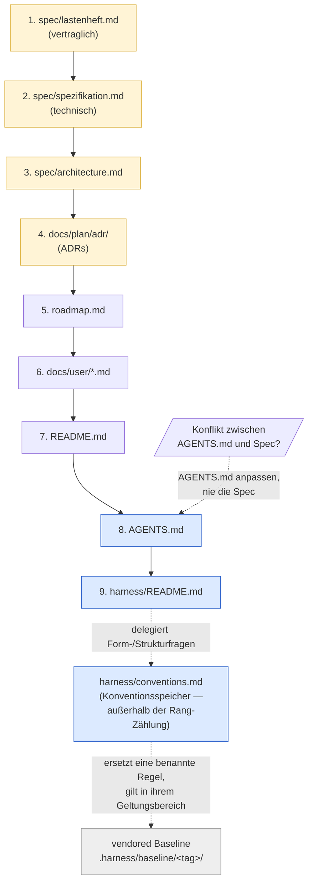
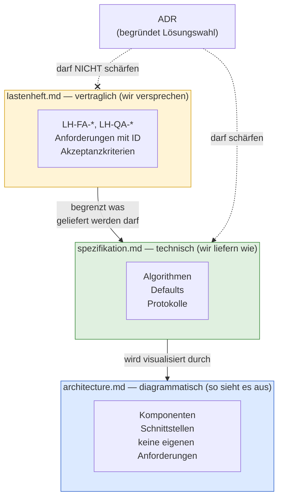

## Source Precedence und Spec-Stratifizierung
<!-- Quelle: [grundlagen/source-precedence.md](https://github.com/pt9912/ai-harness-course/blob/v5.0.0/kurs/de/grundlagen/source-precedence.md) -->

## Source Precedence

Sobald mehr als ein Dokument existiert, gibt es Konflikte. Der Harness
muss vorher festlegen, wer gewinnt. Eine pragmatische Default-Reihenfolge
für ein typisches Repo:

1. `spec/lastenheft.md`
2. `spec/spezifikation.md`
3. `spec/architecture.md`
4. `docs/plan/adr/README.md` und die darin referenzierten ADRs
5. `docs/plan/planning/in-progress/roadmap.md`
6. `docs/user/*.md` (Betriebs-/Operations-Docs — Quality-, Releasing- und
Runbook-*Sichten*)
7. `README.md`
8. `AGENTS.md`
9. `harness/README.md`

Gelb: kanonische Quellen — Spec, Architektur, ADRs. Blau: Harness-Index
und Agenten-Konventionen — sie *beschreiben* die kanonischen Quellen,
sie *ersetzen* sie nicht — `harness/conventions.md` beschreibt sie nicht,
sondern setzt repo-lokale Struktur. Grau: adoptierte Baseline, kein
Repo-Dokument. Durchgezogene Kanten sind die Rangfolge, gestrichelte sind
Zuständigkeits- und Auflösungsbeziehungen.

Regel: Widerspricht `AGENTS.md`, `harness/README.md` oder
`harness/conventions.md` einer kanonischen Quelle, wird die niedriger
rangierte Datei angepasst — nie die kanonische Quelle. Der Harness folgt
der Spec, nicht umgekehrt.

**Die Harness-Schicht darunter: `conventions.md` und die Baseline.**
Zwei Dinge stehen bewusst **nicht** in der Rangliste. `harness/conventions.md`
ist kein weiterer Rang, sondern der **Konventionsspeicher**, an den die
rangierten Dokumente Form- und Strukturfragen *abtreten*: ID-Schemata,
Verzeichniskonvention, Zusatzklassen, Modus-Deklarationen, Adaptionen
([§harness/conventions.md als Konventionsspeicher](grundlagen-harness-dateien.md#harnessconventionsmd-als-konventionsspeicher)).
Wo `AGENTS.md` oder `harness/README.md` zu einer solchen Frage nichts sagen,
entsteht deshalb **kein Konflikt, sondern eine Zuständigkeit** — die Rangliste
entscheidet über *Inhalt*, der Konventionsspeicher über *Form*. Der Platz
wäre ohnehin aufgebraucht — neun Ränge, das
Maximum aus [Modul 1](modul-01-entwicklungszyklus.md).

Das vendored Regelwerk unter `.harness/baseline/<tag>/` steht noch darunter —
übernommenes Fremdmaterial, keine Aussage dieses Repos. Der Anschluss läuft
über den Konventionsspeicher: **Eine `MR-<NNN>` gilt innerhalb ihres
deklarierten Geltungsbereichs vor der Baseline; außerhalb davon gilt die
Baseline unverändert.** Das ist keine zusätzliche Regel, sondern die
Definition einer Adaption — sie steht hier, weil ein Agent, der nur die
Rangliste liest, die Antwort sonst nicht findet.

Daraus folgt die Grenze — sie liegt in der *Wirkung*, nicht im Feld
`Geltungsbereich` (das nennt den Repo-Ausschnitt; den Baseline-Ausschnitt nennt
das eigene Feld `Ersetzt-Baseline-Regel`): Eine `MR-<NNN>`, die
die Baseline **pauschal für nicht anwendbar erklärt**, statt eine benannte Regel
zu ersetzen, ist kein Adaptions-Eintrag mehr, sondern ein **Fork** — sie nimmt
der Baseline die Eigenschaft, gegen die man auditieren kann. *Gelesen wird die Grenze beim **Schreiben** eines Eintrags* — der Adaptions-Block der
`conventions`-Vorlage schickt den Autor hierher; sie ist Entwurfszeit-Regel,
kein Prüfpunkt der Closure. Eine repo-weite
`MR-<NNN>`, die *eine benannte Regel* ersetzt, ist dagegen eine normale
Adaption, und ein Eintrag, der *keine* Abweichung deklariert — die
Baseline-Aussage `MR-000` —, ist weder Fork noch Adaption, sondern die
Adoptions-Erklärung selbst. (Eine *fehlende* Geltungsbereichs-Angabe ist kein
eigener Fall,
sondern ein Formfehler: Das Feld ist Pflicht.) Wird eine `MR-<NNN>`
durch ein Baseline-Update **gegenstandslos**, wird sie nicht überschrieben:
Sie bekommt einen Nachfolger, der sie auflöst und den Baseline-Stand nennt,
der die Ablösung ausgelöst hat — dieselbe Append-only-Disziplin
wie bei ADRs. Widerspricht sie der neuen Fassung, gilt sie in ihrem
Geltungsbereich weiter; der Widerspruch gehört aber benannt
([Modul 2 §Freshness-Audit](modul-02-harness-bootstrap.md)).

**Universal vs projektabhängig.** *Dass* eine Source Precedence existiert
und dass bei Konflikt die niedriger rangierte Quelle angepasst wird, ist
universal (Hard Rule). *Welche* Rangordnung konkret gilt, ist
projektspezifische Entscheidung — die obige Liste ist eine pragmatische
Default-Reihenfolge für ein typisches Referenz/Tooling-Repo, kein
Gesetz. Andere Repo-Klassen können abweichende Rangordnungen begründen:
ein Safety/Control-Repo kann Hardware-Specs vor Software-Specs ranken;
ein Policy/Compliance-Repo kann Regulatorik-Anforderungen vor das
Lastenheft ranken (weil "wir versprechen" durch "wir müssen" begrenzt
wird). Die konkret getroffene Rangwahl und ihre Begründung gehören in
den Adaptions-Block des repo-lokalen Konventionsdokuments (Default-Pfad
`harness/conventions.md`).

## Spec-Stratifizierung

`spec/` zerfällt selbst in drei Straten mit eigener Precedence — alle drei
obligatorisch ([§Spec-Straten](grundlagen-referenz-richtung.md#spec-straten-mehr-als-ein-spec-dokument)):

| Datei                   | Charakter                                                                     | Änderungs-Prozess     |
| ----------------------- | ----------------------------------------------------------------------------- | --------------------- |
| `spec/lastenheft.md`    | **vertraglich abnahmebindend** (`LH-*` / `HSM-*`-IDs)                         | Change Request        |
| `spec/spezifikation.md` | **technisch verbindlich, fortschreibbar** (Algorithmen, Defaults, Protokolle) | ADR-Schärfung erlaubt |
| `spec/architecture.md`  | Diagramme, Komponentensicht, **keine eigenen Anforderungen**                  | Diagramm-Update       |

Drei Schichten, drei Änderungs-Prozesse. Die kritische Hard Rule:
**ADRs DÜRFEN die Spezifikation schärfen, DÜRFEN NICHT das Lastenheft
schärfen.** Diese eine Regel kapselt die gesamte Trennung von
"wir liefern" und "wir versprechen".

„Change Request" ist **bewusst kein Harness-Konstrukt** — kein
`CR-*`-ID-Schema, keine eigene Datei, kein Gate — sondern der *externe*
Vorgang, in dem eine Vertragsänderung mit dem Auftraggeber vereinbart
wird. Im Repo hinterlässt ein *angenommener* Change Request nur einen
**Fußabdruck**: ein Version-Bump des Lastenhefts, eine Zeile in dessen
`## Historie` mit Verweis auf den externen CR (Ticket, Vertragsanhang),
und die geänderten `LH-*`/`HSM-*` selbst. Abgelehnte oder schwebende
CRs leben außerhalb des Repos. Weil nur dieser externe Prozess das
Lastenheft ändern darf, gilt die Hard Rule für *jede* interne Quelle:
**weder ADR noch Slice dürfen `LH-*` je ändern** — sie referenzieren
nur.

**Fallen Auftraggeber- und Entwickler-Rolle zusammen**, fehlt nicht der
Vorgang, sondern nur seine Ticket-Form: Die Rolle ist besetzt, und der
annehmende Akt ist die Entscheidung, die *vor* der Umsetzung fällt. Was die
Regel trägt, ist nicht die **Externalität**, sondern die **Trennung von
Entscheidung und Umsetzung** — und die ist auch ohne Ticket herstellbar. Der
Träger ist dann der **Commit**: Ein angenommener Change Request ändert in
einem eigenen Commit **ausschließlich** das Lastenheft und liegt **vor** dem
Slice, der ihn umsetzt; die Verweis-Spalte nennt diesen Vorgang statt eines
Tickets. Nachträglich ablesbar an `git log -- spec/lastenheft.md`.

Das ist keine Lockerung: Die Hard Rule bleibt, dass **keine interne Quelle**
`LH-*` ändert. Ein Slice, der das Lastenheft im selben Commit mitzieht, hat
die Trennung verloren — gleich, ob ein Ticket existiert oder nicht. Ein Sensor
dafür existiert nicht (kein d-check-Modul prüft, welche Dateien ein Commit
zusammen anfasst); es bleibt ein Review-Griff.

## ID-Schema als Klammer

Ein konsistentes Präfix (`LH-*`, `HSM-*`, `GG-*`) verbindet:

* Anforderung in `spec/lastenheft.md`
* Make-Target-Kommentar (`coverage-gate: ## LH-FA-BUILD-008`)
* ADR-Body (`Bezug: HSM-LESE-004`)
* Commit-Message
* PR-Beschreibung

Damit wird der Traceability-Constraint maschinell prüfbar.
