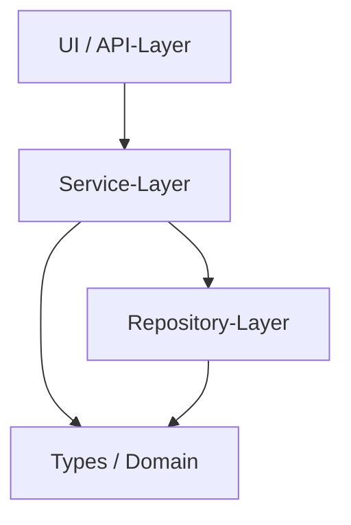
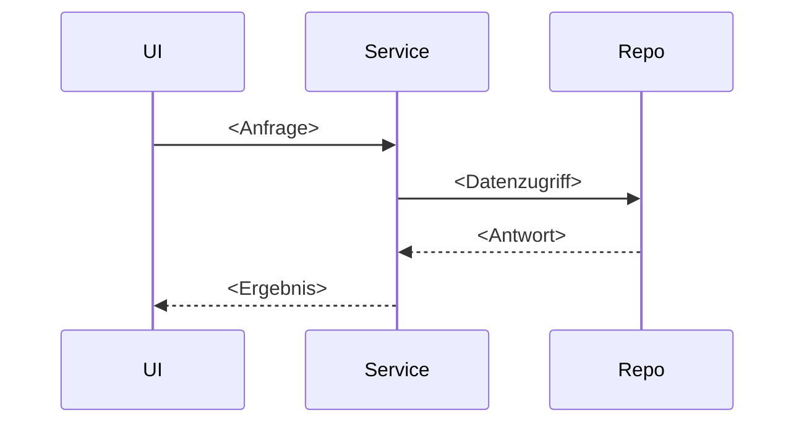

# Architektur — <Projektname>

> **Template-Hinweis.** Diese Datei ist eine Vorlage. Sie ist
> **sprach- und meilensteinfrei** (siehe
> [Baseline-Regelwerk Modul 4](../../regelwerk/modul-04-adrs.md)).
> Kopiere sie nach `spec/architecture.md`, ersetze `<Platzhalter>` und
> lösche diesen Block.

**Status:** Aktiv. **Letzte Änderung:** YYYY-MM-DD.

**Rolle:** Sicht-Stratum — *keine* eigenen Anforderungen, derivativ. Regeln:
Baseline-Regelwerk `modul-04-adrs.md` §Ziel-Form: Architektur-Sicht.

**Hard Rule:** Diese Datei enthält *keine* Wellen, Slices, Commit-Hashes
oder Closure-Daten, **keine ADR-Bezüge** — die Sicht steht im
Stabilitäts-Rang über der ADR — und **keine Historie**: `Letzte Änderung`
oben ist ein Frische-Marker, kein Protokoll. Die zeitliche Schicht lebt in
`docs/plan/planning/in-progress/roadmap.md` und den späteren Closure-Notizen.
Baseline-Regelwerk `modul-04-adrs.md` §Ziel-Form: Architektur-Sicht.

---

## 1. Komponenten-Übersicht

<!--
Ein Diagramm (Mermaid oder ASCII) der Top-Level-Komponenten.
Jeder Kasten benennt die Schicht/Rolle, nicht die Technologie.

Mermaid-Beispiel siehe unten — durch das Begleit-Lab dokumentiert,
aber zwingend ist nur die Klarheit, nicht das Format.
-->

## 2. Schichten und Constraints

Regeln dieser Sektion: Welche ADR eine Layering-Regel verbindlich macht,
deklariert die ADR aufwärts in ihrem `Schärft:`-Feld — kein ADR-Bezug in dieser
Sicht (Baseline-Regelwerk `grundlagen-referenz-richtung.md` §Referenz-Richtung (SDP)).

<!--
Pro Schicht: was sie tut, was sie *nicht* tut. Layering-Regeln, die
durch ArchUnit / depguard / import-linter durchgesetzt werden. Welche
ADR eine Regel verbindlich macht, deklariert die ADR aufwärts in ihrem
Schärft:-Feld (Baseline-Regelwerk `grundlagen-referenz-richtung.md` §Referenz-Richtung (SDP)) — kein ADR-Bezug in dieser Sicht.

Beispiel-Schema (aus OpenAI-Layering, siehe Modul 4):
Types → Config → Repo → Service → Runtime → UI
-->

| Schicht | Verantwortlichkeit | Darf importieren | Darf NICHT importieren |
|---|---|---|---|
| Types | Domain-Modell, Pure | — | alles andere |
| Config | Konfiguration laden/validieren | Types | Service, Runtime, UI |
| Repo | Datenzugriff | Types, Config | Service, Runtime, UI |
| Service | Geschäftslogik | Types, Config, Repo | Runtime, UI |
| Runtime | Bootstrap, DI | alles oben | — |
| UI | API / CLI / GUI | alles oben außer Repo | Repo direkt |

## 3. Externe Abhängigkeiten

<!--
Welche externen Systeme/Bibliotheken sind Teil der Architektur. Die
Wahl-Begründung steht in der ADR (die ihre Schärft auf diese Sicht
deklariert), nicht hier.
-->

| System | Rolle | Substituierbarkeit |
|---|---|---|
| <…> | <…> | <…> |

## 4. Sequenz-Diagramme

<!--
Für jeden kritischen Use-Case (aus Lastenheft) eine Sequenz.
Schichten als Lanes, Aktionen mit IDs aus dem Lastenheft.
-->

### Use-Case: <LH-FA-NN — Titel>

## 5. Fehlermodelle und Resilienz

<!-- Wo werden Fehler abgefangen, propagiert, geloggt. -->

| Fehlerquelle | Behandlung-Schicht | Logging |
|---|---|---|
| <…> | <…> | <…> |
