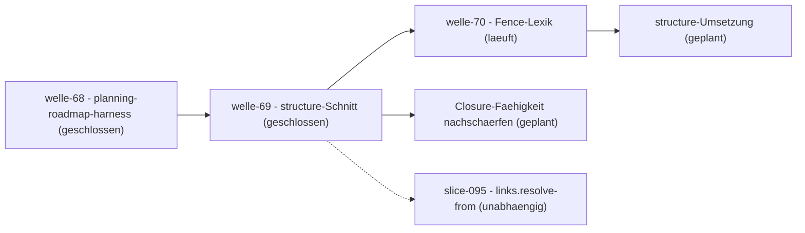

# Roadmap

**Status:** Aktiv. **Letzte Änderung:** 2026-08-10.

**Format-Regel:** Die Roadmap ist eine Reihenfolge von **Wellen**, keine Reihenfolge von
Terminen (siehe [Baseline-Regelwerk `modul-06-roadmap.md`](../../../../.harness/baseline/v5.0.0/regelwerk/modul-06-roadmap.md)).
Termine erscheinen — falls überhaupt — als Konsequenz der Wellen-Schätzung, nie als
Treiber.

---

## Aktuelle Welle

Regeln dieser Sektion: Baseline-Regelwerk `modul-06-roadmap.md`
§Roadmap-Struktur: fünf Abschnitte — *Aktuelle Welle* ist **die laufende**, mit
den drei Pflicht-Bestandteilen (Slice-IDs · Trigger · Closure-Kriterien); das
*Geplante Ende* ist Schätzung, kein Closure-Kriterium.

**Welle-ID:** welle-73-structure-umsetzung
**Start:** 2026-08-10
**Geplantes Ende:** 2026-08-13 (Schätzung, korrigierbar)

**Closure-Trigger:** siehe [Wellendokument](../welle-73-structure-umsetzung.md).

## Nächste Wellen

Regeln dieser Sektion: Baseline-Regelwerk `modul-06-roadmap.md`
§Roadmap-Struktur: fünf Abschnitte, Bullet *Nächste Wellen* — die geordnete
Vorschau: je Zeile Welle, Trigger als beobachtbare Bedingung, wichtigste Slices
und geschätzter Aufwand (S/M/L, kein Termin).

| Welle | Trigger | Wichtigste Slices | Geschätzter Aufwand |
|---|---|---|---|
| Geteilte Lexik an den Rändern | Freigabe; nach welle-70 geschnitten — dieselbe Klasse in anderen Lexiken (`citations`-Absatzbildung, Anker-Auflösung, git-Revisionen) | [slice-103](../open/slice-103-geteilte-lexik-raender.md) | M |

## Meilensteine

Regeln dieser Sektion: Baseline-Regelwerk `modul-06-roadmap.md`
§Welle ≠ Meilenstein ≠ Release.

| Meilenstein | Welle(n) | Trigger | Status |
|---|---|---|---|
| — keine offenen — | | | |

## Abhängigkeitsgraph

Regeln dieser Sektion: Baseline-Regelwerk `modul-06-roadmap.md`
§Roadmap-Struktur: fünf Abschnitte, Bullet *Nächste Wellen* — die Abhängigkeit steht als
beobachtbare Bedingung in der `Trigger`-Spalte **und** als gerichtete Kante hier; eine
Welle, die ohne fertige Vorgängerin nicht starten kann, ist eine Phantom-Welle.

## Abgeschlossene Wellen

Regeln dieser Sektion: Baseline-Regelwerk `modul-06-roadmap.md`
§Roadmap-Struktur: fünf Abschnitte.

| Welle | Abschluss | Closure-Notiz |
|---|---|---|
| welle-69-structure-schnitt | 2026-08-09 | [`welle-69-results.md`](../done/welle-69-results.md) |
| welle-68-planning-roadmap-harness | 2026-08-09 | [`welle-68-results.md`](../done/welle-68-results.md) |
| welle-67-baseline-v500-migration | 2026-08-03 | [`welle-67-results.md`](../done/welle-67-results.md) |
| welle-66-release-prep-aufgabenregel | 2026-07-19 | [`welle-66-results.md`](../done/welle-66-results.md) |
| welle-65-handbuch-aufgaben | 2026-07-19 | [`welle-65-results.md`](../done/welle-65-results.md) |
| welle-64-dpin-ergonomie | 2026-07-19 | [`welle-64-results.md`](../done/welle-64-results.md) |
| welle-63-sources | 2026-07-19 | [`welle-63-results.md`](../done/welle-63-results.md) |
| welle-62-zitat-verifikation | 2026-07-18 | [`welle-62-results.md`](../done/welle-62-results.md) |
| welle-61-referenz-ventil-quell-skopus | 2026-07-18 | [`welle-61-results.md`](../done/welle-61-results.md) |
| welle-60 (Kette slice-071/073/075/076) | 2026-07-17 | [`welle-60-results.md`](../done/welle-60-results.md) |

## Historische Trigger-Verschiebungen

Regeln dieser Sektion: Baseline-Regelwerk `modul-06-roadmap.md`
§Roadmap-Struktur: fünf Abschnitte, Bullet *Historische Trigger-Verschiebungen* — das
Drift-Log: jede Umplanung mit Datum, Änderung, Grund. Leer heißt starre Roadmap, jede
Zeile voll heißt treibende.

| Datum | Was wurde geändert? | Warum? |
|---|---|---|
| 2026-08-09 | **welle-70-fence-lexik eröffnet**; [slice-101](../done/slice-101-fence-unbalanciert.md) `open`→`in-progress` | Der beim slice-096-Review gefundene **ausgelieferte** stille Grün-Pfad im Fence-Automaten wird vorgezogen: er ist bindende Vorbedingung der structure-Umsetzung, und er betrifft ein Gate, das seit v0.52.0 im Feld ist. **Nebenbefund beim Eröffnen:** drei Slice-Köpfe trugen „ohne Welle" — unter der Zwei-Zustands-Kopplung aus [`MR-024`](../../../../harness/conventions.md#mr-024--aktuelle-welle-ruhe-marker-im-wellenlosen-zustand-aktive-welle-template-konform) ist das für einen Slice **in Arbeit** nicht einlösbar (`planning-check` verlangt bei belegtem `in-progress/` eine benannte Welle). Die Köpfe sind korrigiert; ob die Kopplung so bleiben soll, gehört bei der Closure ins Beobachtungs-Register |
| 2026-06-11 | slice-012-Trigger: „slice-011 done" → „slice-011 **und** slice-013 done" | Der [`DC-QA-04`](../../../../spec/lastenheft.md#dc-qa-04--migrationsabdeckung-der-alt-tools)-Vergleichslauf gegen das erweiterte `docs-check.js` zeigte die Inline-Code-Pfad-Prüfung als Konsolidierungs-Lücke; Change Request [`DC-FA-CODE-001`](../../../../spec/lastenheft.md#dc-fa-code-001--explizite-pfade-in-inline-code-modul-codepaths-opt-in) (Lastenheft 0.3.0) als slice-013 eingeschoben |
| 2026-07-17 | **WIP-Limit wiederhergestellt:** slice-071 `in-progress`→`open` (Blocker), slice-076 `in-progress`→`next`; welle-60 führt nur noch slice-073 in Arbeit. Reihenfolge danach: slice-073 zu Ende (vier offene R1-Befunde + bestätigender Review) → Closure → slice-075 | `in-progress/` trug **drei** Slices gleichzeitig; Modul 5: „WIP-Limit pro Implementer = 1 ist eine harte Größe, kein Vorschlag" und `next→in-progress` verlangt „WIP-Limit frei". Bei slice-076 wurde die Bedingung beim Einplanen schlicht nicht geprüft (`6d60094`); slice-071 war bereits blockiert und hätte nach Modul 5 längst zurückgeführt gehört — beides still, bis der Auftraggeber die Regel einforderte. slice-075 erhält Vorrang vor slice-076, weil er produktiv verdrahtetes `trace.coverage` **verfälscht** (Auftraggeber-Meldung grid-gym), während slice-076 Blindheit ohne Falschaussage ist |
| 2026-07-17 | slice-074 aus welle-60 zurückgestellt (`in-progress/` → `open/`), Implementierung zurückgenommen; slice-076 in welle-60 nachgenommen | Drei unabhängige Reviews belegten an fünf aufeinanderfolgenden Fassungen dieselbe Klasse, zuletzt einen Stilles-Grün-Pfad (R3-F-1). Der Realdatenbeleg für slice-071 ist damit weiter blockiert — offen ausgewiesen statt still weitergeschoben. slice-076 kam aus dem Spike, den die Rücknahme ausgelöst hat |
| 2026-07-18 | slice-071 wieder aufgenommen (`open/`→`in-progress/`), welle-60 wieder aktiv | Blocker aufgelöst: die Direktiven-Toleranz aus slice-074 (v0.48.1) lässt den `17. Testarchitektur`-Abschnitt durchlaufen, statt an `architecture.md:913` abzubrechen. WIP-Slot frei (Modul 5), daher `open→next→in-progress` in einem Zug. Der von [ADR-0038](../../adr/0038-trace-cross-consistency.md) Entscheidung 7 geforderte Realdatenbeleg gegen grid-gym ist damit fahrbar |
| 2026-07-18 | **welle-61-referenz-ventil-quell-skopus eröffnet**; slice-078 `open`→`in-progress` (WIP-Slot frei nach welle-60-Abschluss) | §4-Vorfrage vom Auftraggeber entschieden: das erweiterte `ignore-refs`-Ventil (Quell-Skopus `in:`, `refs`/`keep`) wohnt als **neues geteiltes Bereichskürzel** (Ziel-Achsen-Pendant zu [`DC-FA-SCAN-001`](../../../../spec/lastenheft.md#dc-fa-scan-001--datei-auswahl-und-ignorier-regeln)), nicht als Änderung dreier Anforderungen — vermeidet die Verdreifachung der Ventil-Spezifikation, `codepaths.ignore-refs` bleibt Alias. Konsumenten-CR `ai-harness-course` |
| 2026-07-18 | **welle-61 abgeschlossen**; slice-078 `in-progress`→`done`, **v0.49.0 veröffentlicht** | Vollständige Kette umgesetzt: Lastenheft [`DC-FA-REF-001`](../../../../spec/lastenheft.md#dc-fa-ref-001--geteiltes-referenz-ventil-ignore-refs-mit-quell-skopus) + Spec + [ADR-0044](../../adr/0044-geteiltes-referenz-ventil-quell-skopus.md) `Accepted`, Code über `links`/`anchors`/`codepaths` + Alias (Mutations-gepinnt), Realdatenbeleg gegen `ai-harness-course` (Baseline 42 → Ventil 0, nicht durch Wegschauen), Review R1 ACCEPT-WITH-NITS (Nits eingearbeitet). WIP-Slot wieder frei |
| 2026-07-18 | **welle-62-zitat-verifikation eröffnet**; slice-079 `open`→`in-progress` (WIP-Slot frei nach welle-61) | Beide §4-Vorfragen entschieden: Adopter-Rückfrage **empirisch** (33/33 `datei:zeile`-Zitate in `ai-harness-init` in Inline-Code, null Prosa) ⇒ `codepaths`-Erweiterung; Zuschnitt Form (c) (Auftraggeber): Stufe 1/2 als Erweiterung von [`DC-FA-CODE-001`](../../../../spec/lastenheft.md#dc-fa-code-001--explizite-pfade-in-inline-code-modul-codepaths-opt-in), Stufe 3 (`verbatim`) als eigenes Modul mit Direktive `d-check:cite` (durch slice-074 entblockt). Adopter-CR `ai-harness-init` |
| 2026-07-18 | **welle-62 abgeschlossen**; slice-079 `in-progress`→`done`, **v0.50.0 veröffentlicht** | Vollständige Kette: [`DC-FA-CODE-001`](../../../../spec/lastenheft.md#dc-fa-code-001--explizite-pfade-in-inline-code-modul-codepaths-opt-in)-Erweiterung (`check-lines`) + neues [`DC-FA-CITE-001`](../../../../spec/lastenheft.md#dc-fa-cite-001--verbatim-zitat-verifikation-modul-citations-opt-in) (18. Modul `citations`) + Spec + [ADR-0045](../../adr/0045-zitat-verifikation-codepaths-erweiterung-und-citations-modul.md) `Accepted`; opt-in `codepaths.check-lines` (`citation-out-of-range`/`citation-inverted-range`) + Modul `citations` (`d-check:cite`, whitespace-normalisierter Teilstring, `citation-mismatch`), mutations-gepinnt; Realdatenbeleg gegen `ai-harness-init` (korrekt grün, Drift rot, Baseline 0 Direktiven belegt den Substrat-Caveat); Pre-Release-Review R1 BLOCK auf F-1 (Absturz bei `von=0`) → gefixt (1-basierte Untergrenze in beiden Schwestern) → ACCEPT. WIP-Slot wieder frei |
| 2026-07-19 | **welle-63-sources eröffnet**; slice-080 in `in-progress/` angelegt (WIP-Slot frei nach welle-62) | §4-Vorfragen (Nutzer) entschieden: Pin-Deklaration **beides** (Marker + Config), Quelltypen **Einzeldatei + Archiv** (`unpack: zip`); der `pins`/dpin-Hash-Ergonomie-Fix bleibt separat ([`slice-072`](../done/slice-072-handbuch-aufgabenorientierung.md)). Anlass: Nutzer-Frage „Drift gegen Upstream in d-check einbauen" — produktisiert `check_regelwerk_drift.py` als reusables Modul [`DC-FA-SRC-001`](../../../../spec/lastenheft.md#dc-fa-src-001--upstream-content-drift-externer-quellen-modul-sources-opt-in-netz), erweitert [`DC-QA-03`](../../../../spec/lastenheft.md#dc-qa-03--seiteneffektfreiheit-und-netzwerk-sparsamkeit) um eine zweite Netz-Tür |
| 2026-07-19 | **welle-63 abgeschlossen**; slice-080 `in-progress`→`done`, **v0.51.0 veröffentlicht** | Vollständige Kette: [`DC-FA-SRC-001`](../../../../spec/lastenheft.md#dc-fa-src-001--upstream-content-drift-externer-quellen-modul-sources-opt-in-netz) + [ADR-0046](../../adr/0046-sources-upstream-content-drift.md) `Accepted` + Spec-Algorithmus-Sektion + 19. Modul `sources` (Marker+Config, Einzeldatei+Archiv, byte-genaues Content-Manifest). Doppel-Review: R1-doc BLOCK auf Manifest-Kern → ACCEPT, R2-code ACCEPT-WITH-NITS (Marker-Hash-64/Limits/Golden). Realdatenbeleg gegen echtes `lab-regelwerk.zip`, Config-Surface-Doku. Digest `sha256:9197fcf0…1d98`. WIP-Slot wieder frei |
| 2026-07-19 | **welle-64-dpin-ergonomie eröffnet**; slice-081 in `in-progress/` angelegt (WIP-Slot frei nach welle-63) | Nutzer-Entscheid: der in slice-079/080 als „separat" ausgewiesene `pins`/dpin-Ergonomie-Retrofit (voller Ist-Hash im `link-stale`-Befund) wird **eigener** Kleinst-Slice — NICHT in slice-072 (reine §4-Doku, kein Release) quergeschnitten. Nur die nicht stabilitätsgarantierte Befund-`message`, kein Vertragsdelta/ADR; Patch v0.51.1 |
| 2026-07-19 | **welle-64 abgeschlossen**; slice-081 `in-progress`→`done`, **v0.51.1 veröffentlicht** | dpin-Ergonomie: `pins.go` emittiert den vollen Ist-Hash im `link-stale`-Befund (mutations-echter Test); neue Handbuch-Aufgaben-Sektion §5 „Link-Inhalt pinnen". Patch (nur nicht stabilitätsgarantierte Befund-`message`, kein Vertragsdelta/ADR). Digest `sha256:fede3d02…d03c`. WIP-Slot wieder frei |
| 2026-07-19 | **welle-65-handbuch-aufgaben eröffnet**; slice-072 `open`→`in-progress` (WIP-Slot frei nach welle-64) | Der lange als Backlog geführte §4-Aufgabenorientierungs-Slice wird aufgenommen — nachdem der dpin-Ergonomie-Fix (fälschlich zunächst hierher geroutet, vom Auftraggeber korrigiert) als eigener slice-081 erledigt ist, ist slice-072 wieder **reine §4-Doku** (B-1…B-8, kein Release/ADR). No-Regress via die Handbuch-Test-Harnesse (`docexamples_test`/`handbook_examples_test`) in `make gates` |
| 2026-07-19 | **welle-65 abgeschlossen**; slice-072 `in-progress`→`done` | §4 des Benutzerhandbuchs aufgabenorientiert nachgezogen (Benutzerhandbuch-Standard §2/§5): der §4.12-`--trace`-Monolith in §4.12–§4.16 aufgetrennt (RTM/Coverage/Modalität/Kreuzverweis, `--print-mk`→§4.16), Grammatik-/Modalitäts-Referenz→§5, „0 Anforderungen"-Fehlerbild→§7, Versions-Prosa→§11, doppelte WAISE-Definition raus; §4.4-Straffung, `citations`-§5-Titel auf Task-Form; Handbuch 1.42. Zwei unabhängige Reviews: Cluster-Review ACCEPT, Abschluss-Gegenprobe BESTANDEN (12 erledigt/2 bewusst-Ref/0 offen). Reine Doku, kein Release/ADR; `make gates` grün (265/0). WIP-Slot wieder frei |
| 2026-07-19 | **welle-66-release-prep-aufgabenregel eröffnet**; slice-082 in `in-progress/` angelegt (WIP-Slot frei nach welle-65) | slice-072 räumte §4 redaktionell auf, beseitigte aber nicht die **Ursache** (jeder Feature-Slice hängte seine Fähigkeit an §4.12 an, statt eine Aufgabe zu schreiben). Auftraggeber-Entscheid: die billigste dauerhafte Sicherung — eine Release-Prep-Regel „neuer §4-Abschnitt = eigene Aufgabe" — als eigener Folge-Slice, nicht in slice-072 quergeschnitten. Reine Prozess-Doku, kein Release/ADR |
| 2026-07-19 | **welle-66 abgeschlossen**; slice-082 `in-progress`→`done` | Release-Prep-Regel in releasing.md §Release-Prep Punkt 4: ein neuer Handbuch-§4-Abschnitt für ein Feature ist eine **eigene** Aufgabe (nach Benutzerhandbuch-Standard §5), keine Anhängung — schließt den strukturellen §4-Erosions-Bindepunkt, den slice-072 nur redaktionell umging. Ehrlich unenforced (kein Gate), begründet mit Inline-Fakt (§4.12 wuchs auf ~330 Zeilen/8 Themen). Plan-Review ACCEPT-WITH-NITS eingearbeitet (Faktenfehler + Inline-Fakt-Altitude). Reine Prozess-Doku, kein Release/ADR; `make gates` grün (266/0). WIP-Slot wieder frei |
| 2026-08-01 | **welle-67-baseline-v500-migration eröffnet**; slice-084 in `in-progress/` angelegt (WIP-Slot frei nach welle-66) | Abnahme der v5.0.0-Migrations-Analyse (slice-083, nach **drei** Frischkontext-Reviews abnahmereif): die adoptierte Baseline springt `v1.4.0` → `v5.0.0` (zwei Majors — Asset-Umbenennung/3-Straten/8×8-Matrix + grundlagen-Split/konventionen-Entfall). Umsetzung in vier Etappen A–D, **je ein Slice**; Etappe A = Vendoring (slice-084). Reine Harness-/Konventions-Änderung, kein Release/ADR |
| 2026-08-02 | **welle-67 Etappe A abgeschlossen**; slice-084 `in-progress`→`done` (WIP-Slot frei) | Vendoring auf `v5.0.0`: Skript aufs self-contained Bundle gehoben + beide Bäume vendored; atomare Umschaltung (Pin + 7 Live-Pointer + entfallene Quellzeiger umgeschrieben + Tombstone der 3 eingefrorenen Verweise via geteiltem `ignore-refs`), v1.4.0 entfernt, die Vendoring-/Pin-Hebungs-Adaption im Konventionsspeicher deklariert. Unabhängiger Frischkontext-Review **abnahmereif** (LOW 2/INFO 1, Nits eingearbeitet; LOW-1 Under-Copy-md-Filter + LOW-2a interne `<tag>`-Prosa-Drift → Etappe C). `make gates` grün (271/0) |
| 2026-08-02 | **welle-67 Etappe B eröffnet**; slice-085 in `in-progress/` angelegt | Nach Etappe A (Vendoring) liest Etappe B das vendorte v5.0.0-Regelwerk (8 grundlagen + 17 Module) gegen den d-check-Ist und sammelt die Regel-Deltas als Finding-Liste (Schema {Quelle, Regel-Delta, Adaption/Artefakt, Handlung→C/D}); bestimmt den Umfang von Etappe C + D. Reine Lese-/Analyse-Etappe, kein Code/Release/ADR |
| 2026-08-02 | **welle-67 Etappe B abgeschlossen**; slice-085 `in-progress`→`done` (WIP-Slot frei) | Drei Frischkontext-Leser gegen den v5.0.0-Ist → **19 Findings** (8 C / 11 D). Kern: Historie-Provenance-Ausnahme revoziert (C-3, doppelt belegt — `spec/spezifikation.md`+`spec/lastenheft.md` §7 + `matrix.exclude-sections` nicht-konform, Abnahme-Punkt); zwei Korrekturen an der abgenommenen §2.4 (die Guard-Härtungs-Adaptionen sind keine Forks; das `Status`-Feld ist nur template-, nicht grundlagen-gedeckt). Unabhängiger Review + bestätigende Kurz-Re-Review **abnahmereif** (3 MEDIUM/1 LOW eingearbeitet). Flotten-Stand: Flotte auf v3.5.2 → v4/v5-Deltas d-check-first. `make gates` grün |
| 2026-08-02 | **welle-67 Etappe C eröffnet**; slice-086 in `in-progress/` angelegt (WIP-Slot frei nach Etappe B) | Die slice-085-Finding-Liste macht Etappe C verbindlich: `conventions.md` auf die v5.0.0-Default-Form (Index + Datei je MR), Anker-Kompatibilitäts-Block für 173 Links, neue Pflichtfelder, korrigierte Fork-Reklassifikation, Entfall/Verschmelzung, 8×8-Matrix + Historie-Provenance-Bereinigung. **Drei Abnahme-Punkte** (Fork-Klassifikation · Nummern-Kollision · Spec-§7-Bereinigung). Reine Harness-/Konventions-Änderung |
| 2026-08-02 | **welle-67 Etappe C abgeschlossen**; slice-086 `in-progress`→`done` (WIP-Slot frei) | `conventions.md` auf die v5.0.0-Template-Form (Index + Datei je MR; Inline-Baseline-Aussage + `### Aktive`/`### Aufgelöste`-Tabellen): 8 aktive + 15 aufgelöste Einträge, Voll-Slug-Anker in die Index-Zeilen gefaltet (kein Sonderabschnitt), die **188** `conventions.md#mr-`-Links (12 immutable ADRs) erhalten **ohne ADR-Edit**, `ids`-target → `harness/conventions/`, §Anforderungs-Duplikat gelöscht (Verweise auf AGENTS.md §5 retargetet), C-3 herausgeschnitten / C-4 deklariert. Umfangreicher Nutzer-Live-Review (Template-Konformität) + unabhängiger Review **abnahmereif** (4 LOW eingearbeitet). `make gates` + `adr-check` grün |
| 2026-08-02 | **welle-67 slice-087 eröffnet** (Spec-§7-Referenzrichtung, C-3-Nachzug) | Die aus slice-086 §3 Abnahme-Punkt 3 herausgeschnittene C-3-Konformität — **korrigiert:** kein Code-Feature nötig (die Heading-Namen `Geschichte` [46 ADRs] und `7. Historie` [2 Spec-Straten] trennen ADR-/Spec-Provenance schon selektiv), sondern `matrix.exclude-sections` auf `Geschichte` verengen + Spec §7 beider Straten ent-tokenisieren + begleitende ADR (Supersede-Verfeinerung der matrix-Referenzrichtung ggü. der v1.4.0-Historie-Ausnahme). Reine Harness-/Spec-Konformität, kein Release |
| 2026-08-02 | **welle-67 slice-087 abgeschlossen**; `in-progress`→`done` (WIP-Slot frei) | Spec-§7-Referenzrichtung v5.0.0-konform: `spec/spezifikation.md` §7 + `spec/lastenheft.md` §7 entkoppelt (Verweis-Spalte entfernt; slice-Token + neun adr-Abwärtslinks aus der Änderungs-Prosa raus, §7 bleibt lesbare Chronik), `matrix.exclude-sections` von `[Historie, "7. Historie", Geschichte]` auf `[Geschichte]` verengt (nur die immutable ADR-Geschichte bleibt exempt; §7 ab jetzt fail-closed geprüft, live verifiziert). Begleitende ADR Accepted (Supersede-Verfeinerung; die referenzierte immutable ADR byte-identisch). Korrigierte die slice-086-Annahme „braucht ein Code-Feature". Unabhängiger Review abnahmereif (ein LOW/ein INFO eingearbeitet). `make gates` + `make adr-check` grün, kein Release |
| 2026-08-02 | **welle-67 Etappe D eröffnet als Mini-Welle**; slice-088 in `in-progress/` | Etappe D (Form-Konformität, 11 D-Findings aus slice-085 §3) in vier thematische Slices geschnitten (Nutzer-Entscheid): slice-088 Doc-Form (D-1 Roadmap-Abschnitte / D-8 ADR-Trigger / D-11 AGENTS.md), slice-089 Review-Infrastruktur (D-6/D-7/D-10), slice-090 Wellen-Lifecycle + Beobachtungs-Register (D-2/D-3/D-4/D-9), slice-091 Slice-Status-Feld (D-5). slice-088 trägt die mechanische Doc-Form + den Abnahme-Punkt D-1 (Ruhe-Marker ↔ Template). Reine Harness-/Prozess-Doku |
| 2026-08-02 | **Etappe D neu geordnet**: slice-088 auf **Planning-Layer-Form** umgewidmet (D-1/D-2/D-3/D-4/D-9 statt Doc-Form); Doc-Form (D-8/D-11) → slice-089 | Auslöser: welle-67 lief ohne ihr Baseline-Wellendokument (Nutzer-Hinweis) — Roadmap-Form (D-1), Wellen-Lifecycle (D-2) und Beobachtungs-Register (D-3) sind EIN kohärenter Planning-Layer und gehören zuerst; die laufende Welle wird konform dokumentiert (`welle-67-baseline-v500-migration.md` flach angelegt, `observations.md` als stehendes Register mit `— keine —`). Review-Infrastruktur (D-6/D-7/D-10) → slice-090, Slice-Status (D-5) → slice-091 |
| 2026-08-02 | **welle-67 slice-088 abgeschlossen** (Planning-Layer); `in-progress`→`done` (WIP-Slot frei) | Etappe D-1: welle-67-Wellendokument (D-2) + `observations.md` (D-3) + Roadmap auf 6 Baseline-Abschnitte inkl. welle-60..66-results-Backfill (D-1) + Slice-Vorprüfungen modelliert (D-4) + Trigger-Audit im Wellendokument (D-9) + Ruhe-Marker-Adaption im Konventionsspeicher (Abnahme-Punkt 1). Unabhängiger Review abnahmereif (0 HIGH/MEDIUM/LOW, 1 INFO geheilt). `make gates` + `make adr-check` grün. Nächst: slice-089 (Doc-Form D-8/D-11) |
| 2026-08-02 | **welle-67 slice-089 eröffnet** (Doc-Form); slice-088→`done`, slice-089 `in-progress` | Etappe D-2: AGENTS.md an v5.0.0 angleichen — §1-Currency (stale `.harness/cache`/`lab-templates.zip`/„keine-Templates"-Prosa raus, `{regelwerk,templates}`-vendored-Layout + `modul-09`-Kanon-Zeiger rein, D-11), ADR-Re-Evaluierungs-Trigger-Konvention in §5 (D-8; 20 immutable ADRs grandfathered), Slice-Vorprüfungen in §5 (D-4, aus slice-088 delegiert). AGENTS = Source-Precedence-Anker, review-pflichtig |
| 2026-08-02 | **welle-67 slice-089 abgeschlossen** (Doc-Form); `in-progress`→`done` (WIP-Slot frei) | Etappe D-2: AGENTS.md an v5.0.0 angeglichen — §1-Currency (stale Templates-Cache-Prosa raus, `{regelwerk,templates}`-vendored + `modul-09`-Kanon-Zeiger rein, D-11), ADR-Re-Evaluierungs-Trigger-Konvention §5 (D-8; 20 immutable ADRs grandfathered), Slice-Vorprüfungen §5 (D-4). Unabhängiger Review abnahmereif (0 HIGH/MEDIUM/INFO, 1 LOW §5-vs-§6-Drift geheilt). `make gates` + `make adr-check` grün, keine ADR/Spec/Code berührt. Nächst: slice-090 (Review-Infrastruktur D-6/D-7/D-10) |
| 2026-08-02 | **welle-67 slice-090 eröffnet** (Review-Infrastruktur); slice-089→`done`, slice-090 `in-progress` | Etappe D-3: `reviewer.md`-Kopf-Currency (retirete `grundlagen-konventionen.md`/„Kurs-Welle 18" → v5.0.0, D-10) + Report-Kopffelder Review-Art/Skill/Modell-ID + Finding-`klasse` abgestimmt auf `review-report.template.md` (D-6). **D-7** (`closure-note-reviewer`-Skill + `verify-closure-notes`-Gate) fehlt in d-check komplett (kein Skript/Target/Skill, die Closure-Note-Pflicht-ADR ohne Entsprechung) → From-Scratch-Code-Adoption, als Abnahme-Punkt (Folge-Produkt-Slice empfohlen) |
| 2026-08-02 | **welle-67 slice-090 abgeschlossen** (Review-Infrastruktur); `in-progress`→`done` (WIP-Slot frei) | Etappe D-3: `reviewer.md`-Kopf-Currency (D-10) + §Output-/Report-Schema um Finding-`klasse` + Kopf-Metadaten Review-Art/Skill/Modell-ID (D-6, abgestimmt auf `review-report.template.md`). **D-7** (Closure-Note-Gate + Skill) als Folge-Produkt-Slice herausgeschnitten (Nutzer-Entscheid; §Nächste-Wellen-Kandidat). Unabhängiger Review abnahmereif (0 HIGH/MEDIUM/LOW, 1 INFO = Baseline-interne 5-vs-6-Feld-Drift, upstream). `make gates` + `make adr-check` grün. **Letzter** Etappe-D-Slice: slice-091 (Slice-`Status:`-Feld D-5) |
| 2026-08-02 | **welle-67 slice-091 eröffnet** (letzter Etappe-D-Slice); slice-090→`done`, slice-091 `in-progress` | Etappe D-4 (D-5): das `**Status:**`-Feld aus den Slice-Dateien entfernen — Lifecycle-Zustand = Verzeichnis (Baseline `slice.template.md` führt einen `**Lifecycle:**`-Hinweis statt Status). 90 `done/`-Slices betroffen; kein Gate/Skript liest Slice-Status. Abnahme-Punkt: retrofit-all vs. template-forward. Danach welle-67-Closure |
| 2026-08-02 | **welle-67 slice-091 abgeschlossen** (D-5, letzter Etappe-D-Slice); `in-progress`→`done` (WIP-Slot frei) | Slice-`Status:`-Feld go-forward abgeschafft (**template-forward**, Nutzer-Entscheid: kein Retrofit der 90 `done/`-Slices; `**Lifecycle:**`-Hinweis wie Baseline-`slice.template.md`; AGENTS §5 + §3.3 + Lifecycle-Move-Adaption nachgezogen). Unabhängiger Review + bestätigende Re-Review abnahmereif (1 MEDIUM AGENTS-§3.3-Spiegel geheilt). `make gates` + `make adr-check` grün. **Alle welle-67-Slices (084–091) in `done/`** → Welle-Closure folgt |
| 2026-08-03 | **welle-67 geschlossen** (Wave-Self-Close) — Baseline-Migration `v1.4.0`→`v5.0.0` **komplett** | Wellen-Closure-Prozedur (modul-06) durchlaufen: Trigger geprüft (alle 8 Slices in `done/`, `make gates`+`make adr-check` grün), Trigger-Audit (0 aktive Carveouts, keine offene Gate-Reifestufe, C-3-ADR ohne fälligen Re-Eval-Trigger), `welle-67-results.md` geschrieben, Wellendokument per `git mv` nach `done/`. welle-67 aus §Aktuelle Welle → §Abgeschlossene Wellen; §Aktuelle Welle auf Ruhe (keine Folge-Welle). Baseline-Pin `v5.0.0`, beide Bäume vendored |
| 2026-08-03 | **welle-68-planning-roadmap-harness eröffnet**; slice-092 in `in-progress/` | Nutzer-Entscheid nach der v5.0.0-Migration: Planning-/Harness-Welle. Ziel: `## Aktuelle Welle` auf die Template-Struktur-Felder (aktive-Welle-Form, slice-092) + Closure-Note-Reviewer-Skill & `verify-closure-notes`-Gate (D-7, slice-093). **Erkenntnis:** eine aktive Welle trägt die Struktur-Felder ohne Ruhe-Marker (`planning-check` grün) → **kein** `planning`-Modul-Umbau. §Aktuelle Welle damit template-konform. RTM-Generator/`--print-version-md` bleiben §Nächste-Wellen-Kandidaten |
| 2026-08-10 | **welle-73-structure-umsetzung eröffnet**; [slice-099](../in-progress/slice-099-structure-modul.md) `open`→`in-progress` | Freigabe; beide **bindenden** Start-Bedingungen erfüllt (slice-096 und slice-101 in `done/`) — die zweite war Bedingung, nicht Vorliebe: sonst erbte das neue Modul über die geteilte Mechanik einen **bekannten** stillen Grün-Pfad. **Das Mehr gegenüber der Slice-DoD ist eine Verkörperung:** der Slice ändert die Grund-Code-Menge um **neun** Einträge und berührt mehr Spiegel als jeder Slice davor — genau die Klasse, die als **BEO-002** dreimal eingetreten und **kein einziges Mal von einem Gate** gefunden worden ist. Verkörpert als [`MR-025`](../../../../harness/conventions.md#mr-025--semantik-änderung-die-spiegel-vor-dem-editieren-auflisten) — Spiegel-Liste vor dem Editieren, mit der Liste im Konventionsspeicher —, und zwar **vor** dem Slice, damit sie an ihm zum ersten Mal wirkt statt an ihm zum vierten Mal zu fehlen |
| 2026-08-10 | **welle-72 geschlossen** — die Closure-Semantik ist nachgezogen; §Aktuelle Welle war auf Ruhe | Wellen-Closure-Prozedur (modul-06) durchlaufen: Trigger geprüft (beide Slices in `done/`, **ein** Release mit **einer** Notiz, `make fullbuild` grün, Image-Hash `sha256:db7abdf4…6b3b`), Trigger-Audit über alle drei Artefaktklassen, `welle-72-results.md` geschrieben, Wellendokument per `git mv` nach `done/`. Release **v0.56.0** (Digest `sha256:f5055784…dda3`) — **der erste Pipeline-Lauf war rot**: GHCR-Push `denied: denied` bei grünem `make ci`, der Neustart des fehlgeschlagenen Jobs lief durch. **BEO-002 auf 3** gesetzt: in slice-104 standen drei Vertragsflächen auf der widerrufenen Fassung, alle drei fand erst der Review |
| 2026-08-10 | **slice-094 abgeschlossen** + **[slice-104](../done/slice-104-floskel-wortgrenze.md) eröffnet** (kombiniert, damit `in-progress/` nicht leert) | Zähl-Parität geliefert: der Closure-Abschnitt wird **einmal** bereinigt (Fences **und** Inline-Code), alle Bedingungen lesen diesen einen Text, ein Satzende zählt nur vor Whitespace oder Zeilenende. [ADR-0053](../../adr/0053-eine-bereinigung-fuer-alle-closure-bedingungen.md) `Proposed` — die dabei entstehende **Lockerung** der Floskel-Prüfung wird angenommen statt über zwei getrennte Texte umgangen. **Paritäts-Beleg gegen den realen Adopter-Bestand:** 84 von 84 Notizen, identische Satzzahlen, symmetrisch an der Adopter-Schwelle; zwei rote Zwischenstände lagen beide am Überschriften-Muster, nicht an der Zählung. **Das Release bleibt offen — es ist Wellen-Trigger**, nicht Slice-Trigger: beide Slice-Änderungen gehen in einer Notiz raus |
| 2026-08-10 | **welle-72-closure-semantik eröffnet**; [slice-094](../done/slice-094-closure-zaehl-paritaet.md) `open`→`in-progress` (WIP-Slot war frei) | Freigabe des Auftraggebers. Die Klammer beider Slices: sie ändern die **Semantik des ausgelieferten** Closure-Gates, statt etwas hinzuzufügen — deshalb liefen sie in welle-71 bewusst nicht mit. Wellen-Ziel jenseits beider DoDs: **ein** Release mit **einer** Notiz, die jede Richtung einzeln nennt. **Beim Wellen-Schnitt aufgefallen und in keinem der beiden Slices notiert:** beide lockern die **Floskel-Prüfung** — slice-094, weil die Prüfung denselben bereinigten Text liest, aus dem Inline-Code verschwindet; [slice-104](../done/slice-104-floskel-wortgrenze.md), weil Treffer innerhalb eines Wortes entfallen. Einzeln begründet, zusammen zwei Verengungen derselben Prüfung in einem Release. Reihenfolge: 094 zuerst, es trägt die ADR für die Lockerung ([`AGENTS.md` §3.6](../../../../AGENTS.md#36-gates-dürfen-nicht-ohne-adr-gelockert-werden)). Paritäts-Fixtures aus `a-check` beim Start geprüft: Repo liegt vor |
| 2026-08-10 | **welle-71 geschlossen** — die Closure-Fähigkeit ist Obermenge des Konsumenten-Skripts; §Aktuelle Welle auf Ruhe | Wellen-Closure-Prozedur (modul-06) durchlaufen: Trigger geprüft (beide Slices in `done/`, `make fullbuild` grün, Image-Hash `sha256:1f809b6e…49bc`), Trigger-Audit über alle drei Artefaktklassen (0 offene Carveouts, keine stehengebliebene Gate-Reifestufe, kein eingetretener Re-Evaluierungs-Trigger der beiden neuen ADRs), `welle-71-results.md` geschrieben, Wellendokument per `git mv` nach `done/`. Releases **v0.54.0** und **v0.55.0**. **Der Zuschnitt wich bewusst von der Planung ab:** geplant waren drei Slices, geliefert zwei — [slice-094](../done/slice-094-closure-zaehl-paritaet.md) blieb draußen, weil es die Semantik eines **ausgelieferten** Gates ändert statt etwas hinzuzufügen. **Vier Review-Runden über zwei Slices, alle vier blockierend** — zweimal traf der Befund eine Zusage, die ich selbst geschrieben hatte. Register-Lese-Schritt: nichts gestrichen, kein Zähler gewachsen; **BEO-003** war zweimal einschlägig und **wirksam** (verhinderte den Literal-Default und den zweiten Inline-Code-Scanner), **BEO-004** bleibt bei 3 an der Verkörperungs-Schwelle |
| 2026-08-10 | **[slice-104](../done/slice-104-floskel-wortgrenze.md) angelegt** (Change Request des Auftraggebers): der Floskel-Vergleich soll an **Wortgrenzen** statt als Teilstring laufen | Gemessen über die 96 eigenen Closure-Notizen: bei `ok` sind **67 von 68** Treffern Falsch-Positive (68 → 1), `n/a` 2 → 0, `fertig` 3 → 0; mehrwortige Phrasen sind verhaltensgleich (`läuft jetzt` 3 = 3) und die fünf **aktuell** konfigurierten ändern sich nicht — für den eigenen Lauf byte-identisch. Der CR macht damit genau die Phrasen brauchbar, die [slice-093](../done/slice-093-closure-note-gate.md) als Teilstring **verwerfen musste**. Nachgemessen und im Slice benannt: Wortgrenzen machen kurze Phrasen brauchbar, nicht automatisch **sicher** (der eine verbleibende `ok`-Treffer ist echt), und RE2s `\w` ist ASCII-only — die Umlaut-Lage ist ein eigener Abnahme-Punkt. **Nicht begonnen** (WIP-Limit; slice-098 in Arbeit); als Wellen-Kandidat mit [slice-094](../done/slice-094-closure-zaehl-paritaet.md) gebündelt, weil beide dieselbe Risiko-Klasse tragen |
| 2026-08-10 | **slice-097 abgeschlossen** (Release **v0.54.0**) + **[slice-098](../done/slice-098-closure-note-placeholder.md) eröffnet** (kombiniert, damit `in-progress/` nicht leert und die §Aktuelle-Welle-Struktur-Felder halten — dieselbe Form wie bei welle-68) | `planning.closure.glob` liefert der Closure-Fähigkeit ihren eigenen Kandidaten-Filter; Default ist ein **Verweis** auf `slice-glob`. [ADR-0051](../../adr/0051-eigener-kandidaten-filter-closure.md) `Accepted` — sie **verfeinert** [ADR-0048](../../adr/0048-closure-note-struktur-im-planning-modul.md) Entscheidung 1, deren Begründung eine geteilte Config-Achse annahm (ohne Supersede: das Ergebnis ruht auf der geteilten Lifecycle-Invariante, nicht auf der Achse). **Die Bestandsmessung fand einen realen Rückstand, bevor der Schlüssel existierte** — ein geschlossenes Wellendokument trug noch „_Ausstehend._“. Zwei Review-Runden, beide blockierend: die erste kippte meine Abnahme-Entscheidung (die Weitung der eigenen Prüfmenge war ein **Falsch-Negativ** — bei Ergebnisnotizen wird der Dokument-Titel zur Abschnitts-Überschrift), die zweite die zu breite Byte-Identitäts-Zusage. Sieben Rückbauten geprüft. Die Abdeckung der Wellen-Dokumente bleibt **benannt offen** (Modul `structure`) |
| 2026-08-10 | **welle-71-closure-konsumenten-paritaet eröffnet**; [slice-097](../done/slice-097-closure-glob-entkopplung.md) `open`→`in-progress` (WIP-Slot war frei) | Freigabe des Auftraggebers. Ziel jenseits der beiden Slice-DoDs: der Konsument `ai-harness-course` kann sein letztes handgeschriebenes Prüfskript **zurückziehen** — das geht erst, wenn [slice-097](../done/slice-097-closure-glob-entkopplung.md) **und** [slice-098](../done/slice-098-closure-note-placeholder.md) liegen. Der Vorbehalt in beiden Slice-Köpfen („Zuordnung offen bis slice-096") ist mit der welle-69-Closure aufgelöst: beide bleiben eigenständig. **Der Schnitt weicht bewusst von der Roadmap-Planung ab:** [slice-094](../done/slice-094-closure-zaehl-paritaet.md) war für dieselbe Welle vorgesehen und bleibt draußen — 097/098 sind rein **additiv** (rückwärtskompatibler Default, opt-in-Grund-Code Default `false`), 094 ändert die **Zähl-Semantik eines ausgelieferten Gates** in beide Richtungen. Dieselbe Klasse hat in welle-70 eine eigene konsumentensichtbare Zeile gekostet; sie verdient eine eigene Welle mit eigener Bestandsmessung |
| 2026-08-10 | **welle-70 geschlossen** — der ausgelieferte stille Grün-Pfad ist zu; §Aktuelle Welle auf Ruhe | Wellen-Closure-Prozedur (modul-06) durchlaufen: Trigger geprüft (der **eine** Slice der Welle in `done/`, `make fullbuild` grün, Image-Hash `sha256:3042471c…6fd9`), Trigger-Audit über alle drei Artefaktklassen (0 offene Carveouts, keine stehengebliebene Gate-Reifestufe, keiner der drei Re-Evaluierungs-Trigger von [ADR-0050](../../adr/0050-fence-unclosed-in-spans.md) eingetreten), `welle-70-results.md` geschrieben, Wellendokument per `git mv` nach `done/`. Release **v0.53.0** (Digest `sha256:0cbe2d54…9424`). **Drei Review-Runden statt einer:** jede war blockierend, jede fand dieselbe Klasse an einer neuen Stelle — nach Runde eins hätte der Slice abnahmereif ausgesehen und einen offenen Silent-Grün-Pfad im Vollständigkeits-Gate gehabt. Zwei neue Register-Einträge: **BEO-003** (geteilte Lexik driftet an den Rändern) und **BEO-004** bei Zähler **3** (Modul-Grenze nur auf der Quell-Achse — Verkörperungs-Schwelle erreicht). Folge-Slice [slice-103](../open/slice-103-geteilte-lexik-raender.md) geschnitten; der Trigger der structure-Welle ist damit eingetreten |
| 2026-08-09 | **welle-69 geschlossen** — der Schnitt für Struktur-Invarianten steht; §Aktuelle Welle auf Ruhe, §Nächste Wellen auf zwei geplante Wellen | Wellen-Closure-Prozedur (modul-06) durchlaufen: Trigger geprüft (der **eine** Slice der Welle in `done/`, die Entscheidung über die drei liegenden Closure-Slices getroffen, `make fullbuild` grün, Image-Hash `sha256:c42dfc4b…2b11`), Trigger-Audit über alle drei Artefaktklassen, `welle-69-results.md` geschrieben, Wellendokument per `git mv` nach `done/`. **Beim Closure-Check korrigiert:** das Wellendokument führte [slice-099](../in-progress/slice-099-structure-modul.md) fälschlich als **Mitglied** in §4, obwohl §6 die Implementierung ausdrücklich als Out-of-Scope ausweist — damit wäre der eigene Closure-Trigger („alle Slices dieser Welle in `done/`") unerfüllbar gewesen. Die Folge-Slices stehen jetzt derivativ in der Ergebnis-Notiz. Der Trigger-Audit ergab außerdem, dass der Re-Evaluierungs-Trigger von [ADR-0048](../../adr/0048-closure-note-struktur-im-planning-modul.md) („ein zweites Modul braucht dieselbe Closure-Achse") **eingetreten** ist — beantwortet mit der Preset-Kopplung, ohne Supersede, daher als Verfeinerung in [ADR-0049](../../adr/0049-structure-modul-schnitt-und-preset.md) statt als Folge-ADR |
| 2026-08-09 | **welle-69-structure-schnitt eröffnet**; [slice-096](../done/slice-096-structure-modul-analyse.md) `open`→`in-progress` (WIP-Slot war frei) | Freigabe des Change Requests „Struktur-Invarianten über Dokumentklassen" aus dem Schwester-Repo a-check. Der Übergang läuft `open`→`next`→`in-progress` **in einem Zug** — dieselbe Form wie bei slice-078, weil beide Bedingungen zugleich erfüllt waren (Freigabe **und** freier WIP-Slot). **Reihenfolge gegenüber dem ersten Entwurf umgekehrt:** slice-096 stand ursprünglich hinter slice-094; der Backlog-Schnitt-Review zeigte, dass 094 Deckungsgleichheit einer Semantik zusagt, die 096 gerade neu schneidet — und ausgeliefert wird, was zuerst fertig ist. Die drei Closure-Slices (094/097/098) hängen jetzt an 096 und stehen bis zu dessen Abschluss **ohne** Wellen-Zuordnung |
| 2026-08-09 | **welle-68 geschlossen** — der Planning-/Roadmap-Harness ist vollendet; §Aktuelle Welle auf Ruhe | Wellen-Closure-Prozedur durchlaufen: Trigger geprüft (beide Slices in `done/`, `make fullbuild` grün, Image-Hash `sha256:c42dfc4b…2b11`), Trigger-Audit über alle drei Artefaktklassen (0 offene Carveouts, keine stehengebliebene Gate-Reifestufe, kein eingetretener ADR-Re-Evaluierungs-Trigger), `welle-68-results.md` geschrieben, Wellendokument per `git mv` nach `done/`. **Der Scope wuchs unterwegs:** slice-093 lieferte neben der Closure-Note-Struktur eine ungeplante zweite Anforderung (`--config`), weil die Config-Lokalität den gewünschten Closure-Bindepunkt sonst nicht zuließ; das geplante Ende (2026-08-05) verstrich, ohne ein Closure-Kriterium zu berühren. Release **v0.52.0**. Ein nebenbei gefundener Registrierungs-Rückstand blieb bewusst draußen und steht als `BEO-001` im Beobachtungs-Register |
| 2026-08-03 | **welle-68 slice-092 abgeschlossen** + **slice-093 eröffnet** (kombiniert, damit `in-progress/` nicht leert und die §Aktuelle-Welle-Struktur-Felder halten) | slice-092: §Aktuelle Welle template-konform (Struktur-Felder, aktive Welle, kein planning-Modul-Umbau) + die Aktuelle-Welle-Adaption im Konventionsspeicher verfeinert; unabhängig reviewt/abnahmereif. slice-093 = **D-7** (Closure-Note-Reviewer-Skill + `verify-closure-notes`-Gate) — **Produkt-Code** (CR + eigene ADR + Spec + Tests + Release), Design-Abnahme-Punkt offen |
