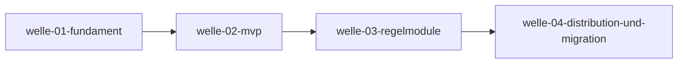

# Roadmap

**Status:** Aktiv. **Letzte Änderung:** 2026-06-10.

**Format-Regel:** Die Roadmap ist eine Reihenfolge von **Wellen**,
keine Reihenfolge von Terminen. Termine erscheinen — falls überhaupt —
als Konsequenz der Wellen-Schätzung, nicht als Treiber.

---

## Aktuelle Welle

**Welle-ID:** welle-04-distribution-und-migration
**Start:** 2026-06-11 (Trigger erfüllt: welle-03 done)
**Slices:**
[slice-010](../done/slice-010-image-integrationstests-und-repro-belege.md)
(done, Image-Integrationstests + `versions`/`fullbuild`/`ci` —
[`DC-FA-DIST-001`](../../../../spec/lastenheft.md#dc-fa-dist-001--docker-image)-AKs
lokal beweisbar),
[slice-011](../done/slice-011-ghcr-release-pipeline.md)
(done, GHCR-Release-Pipeline mit Semver-Tag + Digest-Pin,
[ADR-0002](../../adr/0002-distribution-ghcr-image.md), löst `MR-009`
— nach 010),
[slice-013](../done/slice-013-codepaths-modul.md)
(done, Modul `codepaths` —
[`DC-FA-CODE-001`](../../../../spec/lastenheft.md#dc-fa-code-001--explizite-pfade-in-inline-code-modul-codepaths-opt-in),
Change Request 0.3.0; Einschub vor 012),
[slice-012](../open/slice-012-pilot-migrationen.md)
(open, Pilot-Migrationen in 3 Repos
([`DC-QA-04`](../../../../spec/lastenheft.md#dc-qa-04--migrationsabdeckung-der-alt-tools):
Shell-, Python-/u-boot-, JS-Vertreter) — nach 011 + 013, schließt die
Welle).

**Closure-Trigger:** Image auf GHCR veröffentlicht (Semver-Tag,
Digest-Pin); DIST-Akzeptanzkriterien als Integrationstests grün;
`versions`/`fullbuild`/`ci` existieren und sind dokumentiert; Modul
`codepaths` implementiert (Change Request 0.3.x, slice-013);
mindestens drei Pilot-Migrationen mit Vergleichslauf dokumentiert.

## Nächste Wellen

| Welle | Trigger | Wichtigste Slices | Geschätzter Aufwand |
|---|---|---|---|
| — (nach welle-04 per Roadmap-Fortschreibung) | | | |

## Meilensteine

| Meilenstein | Welle(n) | Trigger | Status |
|---|---|---|---|
| M1: Spec-Fundament steht | welle-01 | Closure-Trigger welle-01 | **erreicht** (2026-06-10) |
| M2: Dogfooding — `d-check` prüft die eigene Doku | welle-02 | slice-004 done, vendorter Bootstrap-Sensor gelöscht | **erreicht** (2026-06-10) |
| M3: erstes GHCR-Release + Pilot-Migration | welle-04 | Image veröffentlicht, ≥1 Repo migriert | offen |

## Abhängigkeitsgraph

## Abgeschlossene Wellen

| Welle | Abschluss | Closure-Notiz |
|---|---|---|
| welle-01-fundament | 2026-06-10 | [slice-001 §7](../done/slice-001-adr-fundament.md#7-closure-notiz-nach-done), [slice-002 §7](../done/slice-002-architektur-und-spezifikation.md#7-closure-notiz-nach-done) |
| welle-02-mvp | 2026-06-10 | [slice-003 §7](../done/slice-003-cli-kern-und-links-modul.md#7-closure-notiz-nach-done), [slice-004 §7](../done/slice-004-anchors-modul-und-dogfooding.md#7-closure-notiz-nach-done) |
| welle-03-regelmodule | 2026-06-11 | [slice-005 §7](../done/slice-005-lint-profil-solid.md#7-closure-notiz-nach-done), [slice-006 §7](../done/slice-006-ids-modul.md#7-closure-notiz-nach-done), [slice-007 §7](../done/slice-007-matrix-modul-selbstkonfiguration.md#7-closure-notiz-nach-done), [slice-008 §7](../done/slice-008-external-modul.md#7-closure-notiz-nach-done), [slice-009 §7](../done/slice-009-coverage-und-meta-gates.md#7-closure-notiz-nach-done) |

## Historische Trigger-Verschiebungen

| Datum | Was wurde geändert? | Warum? |
|---|---|---|
| 2026-06-11 | slice-012-Trigger: „slice-011 done" → „slice-011 **und** slice-013 done" | Der [`DC-QA-04`](../../../../spec/lastenheft.md#dc-qa-04--migrationsabdeckung-der-alt-tools)-Vergleichslauf gegen das erweiterte `docs-check.js` zeigte die Inline-Code-Pfad-Prüfung als Konsolidierungs-Lücke; Change Request [`DC-FA-CODE-001`](../../../../spec/lastenheft.md#dc-fa-code-001--explizite-pfade-in-inline-code-modul-codepaths-opt-in) (Lastenheft 0.3.0) als slice-013 eingeschoben |
