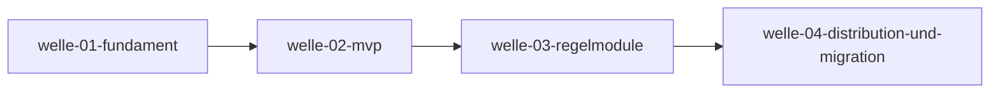

# Roadmap

**Status:** Aktiv. **Letzte Änderung:** 2026-06-10.

**Format-Regel:** Die Roadmap ist eine Reihenfolge von **Wellen**,
keine Reihenfolge von Terminen. Termine erscheinen — falls überhaupt —
als Konsequenz der Wellen-Schätzung, nicht als Treiber.

---

## Aktuelle Welle

**Welle-ID:** welle-02-mvp
**Start:** 2026-06-10
**Slices:** [slice-003](slice-003-cli-kern-und-links-modul.md) (in-progress), [slice-004](../open/slice-004-anchors-modul-und-dogfooding.md)

**Closure-Trigger:** CLI-Kern mit Modulen `links` + `anchors`
implementiert und getestet; `make doc-check` läuft über `d-check`
selbst (Dogfooding, vendorter Bootstrap-Sensor gelöscht);
Implementierungs-Gates (`lint`, `test`, `arch-check`) existieren und
sind in `make gates` aggregiert.

## Nächste Wellen

| Welle | Trigger | Wichtigste Slices | Geschätzter Aufwand |
|---|---|---|---|
| welle-03-regelmodule | welle-02 done | Module `ids`, `matrix`, `external`; Gate-Ausbau: `coverage-gate` (bootstrap-aware), `gate-consistency` (Slices werden bei Wellen-Start geschnitten) | M |
| welle-04-distribution-und-migration | welle-03 done | GHCR-Release-Pipeline ([`DC-FA-DIST-001`](../../../../spec/lastenheft.md#dc-fa-dist-001--docker-image)), Reproduzierbarkeits-Belege (`versions`, `fullbuild` mit Image-Hash), Pilot-Migrationen in 3 Repos ([`DC-QA-04`](../../../../spec/lastenheft.md#dc-qa-04--migrationsabdeckung-der-alt-tools)) | M |

## Meilensteine

| Meilenstein | Welle(n) | Trigger | Status |
|---|---|---|---|
| M1: Spec-Fundament steht | welle-01 | Closure-Trigger welle-01 | **erreicht** (2026-06-10) |
| M2: Dogfooding — `d-check` prüft die eigene Doku | welle-02 | slice-004 done, vendorter Bootstrap-Sensor gelöscht | offen |
| M3: erstes GHCR-Release + Pilot-Migration | welle-04 | Image veröffentlicht, ≥1 Repo migriert | offen |

## Abhängigkeitsgraph

## Abgeschlossene Wellen

| Welle | Abschluss | Closure-Notiz |
|---|---|---|
| welle-01-fundament | 2026-06-10 | [slice-001 §7](../done/slice-001-adr-fundament.md#7-closure-notiz-nach-done), [slice-002 §7](../done/slice-002-architektur-und-spezifikation.md#7-closure-notiz-nach-done) |

## Historische Trigger-Verschiebungen

| Datum | Was wurde geändert? | Warum? |
|---|---|---|
| — | | |
