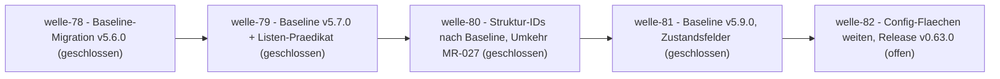

# Roadmap

**Format-Regel:** Die Roadmap ist eine Reihenfolge von **Wellen**, keine Reihenfolge von
Terminen (siehe [Baseline-Regelwerk `modul-06-roadmap.md`](../../../../.harness/baseline/v5.9.0/regelwerk/modul-06-roadmap.md)).
Termine erscheinen — falls überhaupt — als Konsequenz der Wellen-Schätzung, nie als
Treiber.

---

## Offene Wellen

Regeln dieser Sektion: Baseline-Regelwerk `modul-06-roadmap.md`
§Roadmap-Struktur (v5.9.0): *Offene Wellen* trägt **zwei unabhängige
Aussagen**. Die **Liste** folgt den Dateien — je offener Welle-Datei ein
Zeiger; Ziel, Trigger und Closure-Kriterien stehen in der Welle-Datei,
nicht hier, das *Geplante Ende* dort ist Schätzung, kein Closure-Kriterium,
und woran gerade gearbeitet wird, sagt das `Welle:`-Feld der Slices in
`in-progress/`. Der deklarierte **Ruhe-Marker** folgt dem Anspruch — er
steht genau dann, wenn `in-progress/` keinen Slice trägt, **zusätzlich**
zur Liste, nicht an ihrer Stelle; beides zugleich ist der Normalfall
direkt nach der Wellen-Eröffnung. Gewächtert ist die Marker-Hälfte in
beide Richtungen (`make planning-check` hält ihn gegen das Verzeichnis);
die Listen-Hälfte misst `wave-drift` als Kennungs-Bijektion (je offener
Welle-Datei ein Zeiger, beidseitig; `waves.mode: many`) — diese Prosa
bleibt deshalb frei von Wellen-Kennungen.

**Mehr-Wellen-Betrieb ist zugelassen** (Roadmap-Entscheid des Auftraggebers,
2026-08-22): unabhängige Stränge — etwa eine Baseline-Hebung neben einer
Produkt-Welle — dürfen gleichzeitig als flache Wellendokumente offen sein; je
Strang ein Zeiger in der Liste, die Bijektion hält beides, und das
`Welle:`-Feld des Slices sagt, wohin er gehört. Eröffnet wird weiterhin nur,
was einen eigenen Closure-Grund hat (Baseline-Regelwerk `modul-06-roadmap.md`
§Wann Arbeit eine Welle braucht) — Parallelität ist Erlaubnis, kein Ziel.

- [welle-82-config-flaechen](../welle-82-config-flaechen.md) — drei Konfigurations-Flächen additiv weiten, Release v0.63.0 (Auftraggeber-Freigabe 2026-08-22)

## Nächste Wellen

Regeln dieser Sektion: Baseline-Regelwerk `modul-06-roadmap.md`
§Roadmap-Struktur: fünf Abschnitte, Bullet *Nächste Wellen* — die geordnete
Vorschau: je Zeile Welle, Trigger als beobachtbare Bedingung, wichtigste Slices
und geschätzter Aufwand (S/M/L, kein Termin).

| Welle | Trigger | Wichtigste Slices | Geschätzter Aufwand |
|---|---|---|---|
| — keine — | | | |

## Meilensteine

Regeln dieser Sektion: Baseline-Regelwerk `modul-06-roadmap.md`
§Welle ≠ Meilenstein ≠ Release.

| Meilenstein | Welle(n) | Trigger | Status |
|---|---|---|---|
| — keine — | | | |

Status-Form für den nächsten Eintrag: `offen` oder `erreicht <Datum>` samt Beleg als
auflösbarer Anker (Tag, Workflow-Lauf, Ergebnisnotiz); die Status-Zelle erzählt nicht,
wie es dazu kam. Erreichte Meilensteine gehören **hierher** und nicht ins Drift-Log —
die drei erreichten dieses Repos sind vor dieser Regel aus der Tabelle entfernt worden
und werden nicht rekonstruiert; ihr Beleg ist die Release-Historie.

## Abhängigkeitsgraph

Regeln dieser Sektion: Baseline-Regelwerk `modul-06-roadmap.md`
§Roadmap-Struktur: fünf Abschnitte, Bullet *Nächste Wellen* — die Abhängigkeit steht als
beobachtbare Bedingung in der `Trigger`-Spalte **und** als gerichtete Kante hier; eine
Welle, die ohne fertige Vorgängerin nicht starten kann, ist eine Phantom-Welle.

## Abgeschlossene Wellen

Regeln dieser Sektion: Baseline-Regelwerk `modul-06-roadmap.md`
§Roadmap-Struktur: fünf Abschnitte.

| Welle | Abschluss | Closure-Notiz |
|---|---|---|
| welle-81-zustandsfelder | 2026-08-22 | [`welle-81-results.md`](../done/welle-81-results.md) |
| welle-80-struktur-ids | 2026-08-22 | [`welle-80-results.md`](../done/welle-80-results.md) |
| welle-79-zwei-haelften-ein-waechter | 2026-08-21 | [`welle-79-results.md`](../done/welle-79-results.md) |
| welle-78-baseline-v560-migration | 2026-08-21 | [`welle-78-results.md`](../done/welle-78-results.md) |
| welle-77-chronologie-ordnung | 2026-08-21 | [`welle-77-results.md`](../done/welle-77-results.md) |
| welle-76-ortsfeste-verweise | 2026-08-16 | [`welle-76-results.md`](../done/welle-76-results.md) |
| welle-75-wellen-register | 2026-08-16 | [`welle-75-results.md`](../done/welle-75-results.md) |
| welle-74-geteilte-lexik-raender | 2026-08-16 | [`welle-74-results.md`](../done/welle-74-results.md) |
| welle-73-structure-umsetzung | 2026-08-15 | [`welle-73-results.md`](../done/welle-73-results.md) |
| welle-72-closure-semantik | 2026-08-10 | [`welle-72-results.md`](../done/welle-72-results.md) |
| welle-71-closure-konsumenten-paritaet | 2026-08-10 | [`welle-71-results.md`](../done/welle-71-results.md) |
| welle-70-fence-lexik | 2026-08-10 | [`welle-70-results.md`](../done/welle-70-results.md) |
| welle-69-structure-schnitt | 2026-08-09 | [`welle-69-results.md`](../done/welle-69-results.md) |
| welle-68-planning-roadmap-harness | 2026-08-09 | [`welle-68-results.md`](../done/welle-68-results.md) |
| welle-67-baseline-v500-migration | 2026-08-03 | [`welle-67-results.md`](../done/welle-67-results.md) |
| welle-66-release-prep-aufgabenregel | 2026-07-19 | [`welle-66-results.md`](../done/welle-66-results.md) |
| welle-65-handbuch-aufgaben | 2026-07-19 | [`welle-65-results.md`](../done/welle-65-results.md) |
| welle-64-dpin-ergonomie | 2026-07-19 | [`welle-64-results.md`](../done/welle-64-results.md) |
| welle-63-sources | 2026-07-19 | [`welle-63-results.md`](../done/welle-63-results.md) |
| welle-62-zitat-verifikation | 2026-07-18 | [`welle-62-results.md`](../done/welle-62-results.md) |
| welle-61-referenz-ventil-quell-skopus | 2026-07-18 | [`welle-61-results.md`](../done/welle-61-results.md) |
| welle-60 (Kette slice-071/073/075/076) | 2026-07-17 | [`welle-60-results.md`](../done/welle-60-results.md) |

## Historische Trigger-Verschiebungen

Regeln dieser Sektion: Baseline-Regelwerk `modul-06-roadmap.md`
§Roadmap-Struktur: fünf Abschnitte, Bullet *Historische Trigger-Verschiebungen* — das
Drift-Log: **nur Umplanungen** mit Datum, Änderung, Grund — Trigger verschoben,
präzisiert oder ersetzt; Slice oder Welle umgehängt oder neu geschnitten. **Keine**
Schließungen (die stehen im Closure-Log darüber) und **keine** erreichten Meilensteine
(die stehen in der Status-Spalte) — sonst führt diese Tabelle ein zweites Closure-Log,
und zwei Logs driften. Leer heißt starre Roadmap, jede Zeile voll heißt treibende.

| Datum | Was wurde geändert? | Warum? |
|---|---|---|
| 2026-08-21 | **slice-110 neu geschnitten** beim Öffnen von welle-79 | Beim Öffnen zeigte die Sichtung, dass der Bump und die Produkt-Konsequenz zwei Slices sind statt eines. |
| 2026-08-21 | **Etappe C geschnitten** — welle-78 §4 um [slice-108](../done/slice-108-roadmap-offene-wellen.md) (C-1: Roadmap auf §Offene Wellen) und [slice-109](../done/slice-109-v560-konventions-nachzuege.md) (C-2…C-6: ID-Schema-Deklaration, Kommentar-Regel-Träger, Kennungs-Anker, Leseordnung, Bestands-Stichprobe) nachgeführt | Der Stufen-Audit ([slice-107](../done/slice-107-baseline-v560-delta-audit.md) §9) liegt vor: je Regel eine Antwort über sechs Stufen. **Der größte Befund ist die Roadmap-Form selbst** — v5.5.0 ersetzt §Aktuelle Welle durch §Offene Wellen (derivativ, Marker „Nichts in Arbeit"); das Produkt deckt die neue Form per Config, der Entscheid folgt der Auftraggeber-Linie „Baseline-Default sticht". Konform-Belege ohne Handlung je Zeile (u. a. `.a`-Verfeinerung, TA-7/Hauptzweig, Gate-Obermenge-Nachweis), n.-a.-Belege mit Begründung (Reconciliation/BF, Golden-Set/deterministischer Kern, team-sim, Mehr-Schreiber-Teile). **Wiedervorlage slice-090:** die upstream 5-vs-6-Feld-Drift besteht in v5.6.0 fort (modul-10 fünf Felder, Template sechs) — Upstream-Notiz, keine d-check-Handlung |
| 2026-08-21 | **slice-106 neu geschnitten** beim Öffnen von welle-78 | Beim Öffnen zeigte die Sichtung, dass die Migration in Etappen zerfällt statt in einen Slice. |
| 2026-08-21 | **slice-105 neu geschnitten** beim Öffnen von welle-77 | Beim Öffnen zeigte die Sichtung, dass die Chronologie-Regel als eigener Slice trägt. |
| 2026-08-10 | **[slice-104](../done/slice-104-floskel-wortgrenze.md) angelegt** (Change Request des Auftraggebers): der Floskel-Vergleich soll an **Wortgrenzen** statt als Teilstring laufen | Gemessen über die 96 eigenen Closure-Notizen: bei `ok` sind **67 von 68** Treffern Falsch-Positive (68 → 1), `n/a` 2 → 0, `fertig` 3 → 0; mehrwortige Phrasen sind verhaltensgleich (`läuft jetzt` 3 = 3) und die fünf **aktuell** konfigurierten ändern sich nicht — für den eigenen Lauf byte-identisch. Der CR macht damit genau die Phrasen brauchbar, die [slice-093](../done/slice-093-closure-note-gate.md) als Teilstring **verwerfen musste**. Nachgemessen und im Slice benannt: Wortgrenzen machen kurze Phrasen brauchbar, nicht automatisch **sicher** (der eine verbleibende `ok`-Treffer ist echt), und RE2s `\w` ist ASCII-only — die Umlaut-Lage ist ein eigener Abnahme-Punkt. **Nicht begonnen** (WIP-Limit; slice-098 in Arbeit); als Wellen-Kandidat mit [slice-094](../done/slice-094-closure-zaehl-paritaet.md) gebündelt, weil beide dieselbe Risiko-Klasse tragen |
| 2026-08-02 | **Etappe D neu geordnet**: slice-088 auf **Planning-Layer-Form** umgewidmet (D-1/D-2/D-3/D-4/D-9 statt Doc-Form); Doc-Form (D-8/D-11) → slice-089 | Auslöser: welle-67 lief ohne ihr Baseline-Wellendokument (Nutzer-Hinweis) — Roadmap-Form (D-1), Wellen-Lifecycle (D-2) und Beobachtungs-Register (D-3) sind EIN kohärenter Planning-Layer und gehören zuerst; die laufende Welle wird konform dokumentiert (`welle-67-baseline-v500-migration.md` flach angelegt, `observations.md` als stehendes Register mit `— keine —`). Review-Infrastruktur (D-6/D-7/D-10) → slice-090, Slice-Status (D-5) → slice-091 |
| 2026-07-18 | slice-071 wieder aufgenommen (`open/`→`in-progress/`), welle-60 wieder aktiv | Blocker aufgelöst: die Direktiven-Toleranz aus slice-074 (v0.48.1) lässt den `17. Testarchitektur`-Abschnitt durchlaufen, statt an `architecture.md:913` abzubrechen. WIP-Slot frei (Modul 5), daher `open→next→in-progress` in einem Zug. Der von [ADR-0038](../../adr/0038-trace-cross-consistency.md) Entscheidung 7 geforderte Realdatenbeleg gegen grid-gym ist damit fahrbar |
| 2026-07-17 | slice-074 aus welle-60 zurückgestellt (`in-progress/` → `open/`), Implementierung zurückgenommen; slice-076 in welle-60 nachgenommen | Drei unabhängige Reviews belegten an fünf aufeinanderfolgenden Fassungen dieselbe Klasse, zuletzt einen Stilles-Grün-Pfad (R3-F-1). Der Realdatenbeleg für slice-071 ist damit weiter blockiert — offen ausgewiesen statt still weitergeschoben. slice-076 kam aus dem Spike, den die Rücknahme ausgelöst hat |
| 2026-07-17 | **WIP-Limit wiederhergestellt:** slice-071 `in-progress`→`open` (Blocker), slice-076 `in-progress`→`next`; welle-60 führt nur noch slice-073 in Arbeit. Reihenfolge danach: slice-073 zu Ende (vier offene R1-Befunde + bestätigender Review) → Closure → slice-075 | `in-progress/` trug **drei** Slices gleichzeitig; Modul 5: „WIP-Limit pro Implementer = 1 ist eine harte Größe, kein Vorschlag" und `next→in-progress` verlangt „WIP-Limit frei". Bei slice-076 wurde die Bedingung beim Einplanen schlicht nicht geprüft (`6d60094`); slice-071 war bereits blockiert und hätte nach Modul 5 längst zurückgeführt gehört — beides still, bis der Auftraggeber die Regel einforderte. slice-075 erhält Vorrang vor slice-076, weil er produktiv verdrahtetes `trace.coverage` **verfälscht** (Auftraggeber-Meldung grid-gym), während slice-076 Blindheit ohne Falschaussage ist |
| 2026-06-11 | slice-012-Trigger: „slice-011 done" → „slice-011 **und** slice-013 done" | Der [`DC-QA-04`](../../../../spec/lastenheft.md#dc-qa-04--migrationsabdeckung-der-alt-tools)-Vergleichslauf gegen das erweiterte `docs-check.js` zeigte die Inline-Code-Pfad-Prüfung als Konsolidierungs-Lücke; Change Request [`DC-FA-CODE-001`](../../../../spec/lastenheft.md#dc-fa-code-001--explizite-pfade-in-inline-code-modul-codepaths-opt-in) (Lastenheft 0.3.0) als slice-013 eingeschoben |
