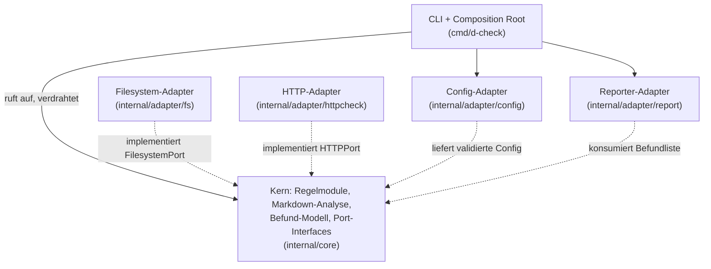
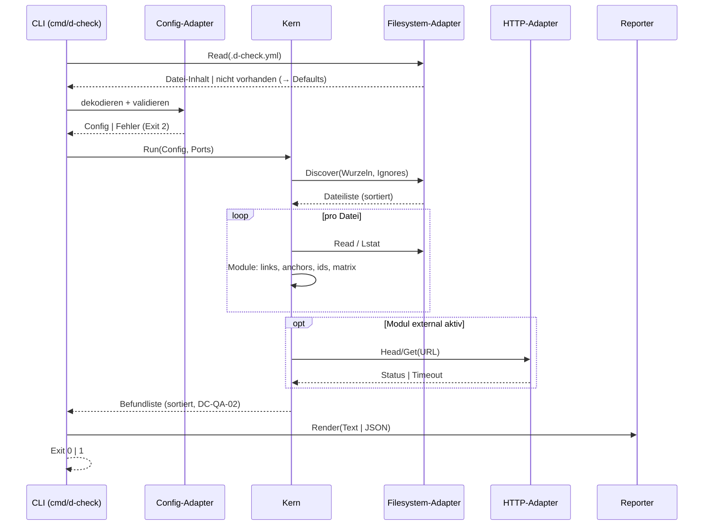

# Architektur — d-check

**Status:** Aktiv. **Letzte Änderung:** 2026-06-10.

**Hard Rule:** Diese Datei enthält *keine* Wellen, Slices,
Commit-Hashes oder Closure-Daten (`AGENTS.md` §3.4). Die zeitliche
Schicht lebt in `docs/plan/planning/`.

**Bezug:** [`lastenheft.md`](lastenheft.md) und
[`spezifikation.md`](spezifikation.md) — bei Konflikt gewinnen diese.
Der hexagonale Schnitt („Hexagon light") ist per ADR entschieden; die
Begründung lebt dort, und die ADRs deklarieren ihre Schärfung dieser
Datei aufwärts (`Schärft:`-Feld). Spec-Straten verweisen nicht abwärts
auf ADRs oder Planning-Artefakte.

---

## 1. Komponenten-Übersicht

Das CLI ist der **einzige driving Adapter** (kein Server-Modus). Die
Regelmodule (`links`, `anchors`, `ids`, `matrix`, `external`) sind
Strategien im Kern hinter einem gemeinsamen Interface
([`DC-FA-CLI-002`](lastenheft.md#dc-fa-cli-002--regelmodul-auswahl));
neue Module sind Kern-Erweiterungen, keine Architekturänderungen.

## 2. Schichten und Constraints

| Bereich (Pfad) | Verantwortlichkeit | Darf importieren | Darf NICHT importieren |
|---|---|---|---|
| Kern (`internal/core`) | Markdown-Vorverarbeitung, Link-/Heading-/Kennungs-Extraktion, Slug, Regelmodule, Befund-Modell, deterministische Sortierung, Pfad-/Escape-Regeln; definiert die Ports | reine Stdlib (ohne I/O) | `os`, `net`, `net/http`, `syscall`, `internal/adapter/*`, `gopkg.in/yaml.v3` |
| Filesystem-Adapter (`internal/adapter/fs`) | Datei-Discovery, Lesen, Lstat/Symlink-Erkennung | Kern-Ports, `os`, `io/fs`, `path/filepath` | andere Adapter, `net/http` |
| HTTP-Adapter (`internal/adapter/httpcheck`) | HEAD/GET-Erreichbarkeit, Timeout, Redirect-Limit | Kern-Ports, `net/http` | andere Adapter, `os` |
| Config-Adapter (`internal/adapter/config`) | `.d-check.yml` strikt dekodieren, zweistufig validieren (den Datei-Inhalt beschafft das CLI über den Filesystem-Adapter — `os` bleibt dort die einzige I/O-Tür) | Kern-Typen, `gopkg.in/yaml.v3` | andere Adapter, `os`, `net/http` |
| Reporter-Adapter (`internal/adapter/report`) | Text-/JSON-Rendering auf stdout/stderr | Kern-Typen, `encoding/json` | andere Adapter, `net/http` |
| CLI (`cmd/d-check`) | Argument-Parsing, Composition Root, Exit-Code | alles oben | — |

Diese Tabelle ist die Quelle der `arch-check`-Fitness-Function; eine
Lockerung ist eine neue ADR (`AGENTS.md` §3.6).

## 3. Externe Abhängigkeiten

| System | Rolle | Substituierbarkeit |
|---|---|---|
| `gopkg.in/yaml.v3` | YAML-Decoding im Config-Adapter | hoch — vollständig im Adapter gekapselt |
| Go-Stdlib `net/http` | Erreichbarkeits-Checks im HTTP-Adapter | hoch — hinter HTTPPort |
| distroless/static (Runtime-Image) | Auslieferung | mittel — CA-Bundle/nonroot-Annahmen |

## 4. Sequenz-Diagramme

### Use-Case: [`DC-FA-CLI-001`](lastenheft.md#dc-fa-cli-001--aufruf-und-scan-wurzel) — Prüflauf

## 5. Fehlermodelle und Resilienz

| Fehlerquelle | Behandelnde Schicht | Wirkung |
|---|---|---|
| ungültige CLI-Nutzung | CLI | stderr, Exit 2 |
| ungültige `.d-check.yml` (Syntax/Semantik) | Config-Adapter | stderr mit Zeilenangabe, Exit 2, keine Prüfung |
| Scan-Wurzel/Datei nicht lesbar | Filesystem-Adapter → CLI | stderr, Exit 2 (kein Teilergebnis als Erfolg) |
| Regelverletzung in Doku | Kern (Regelmodule) | Befund, Exit 1 |
| HTTP-Fehler/Timeout (`external`) | HTTP-Adapter → Kern | Befund, kein Abbruch |

Der Kern wirft keine I/O-Fehler selbst — sie erreichen ihn als
Port-Ergebnisse; das geprüfte Repository wird nie beschrieben
([`DC-QA-03`](lastenheft.md#dc-qa-03--seiteneffektfreiheit-und-netzwerk-sparsamkeit)).
