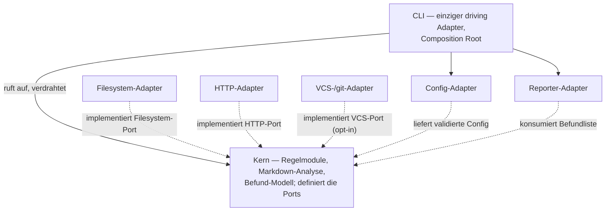
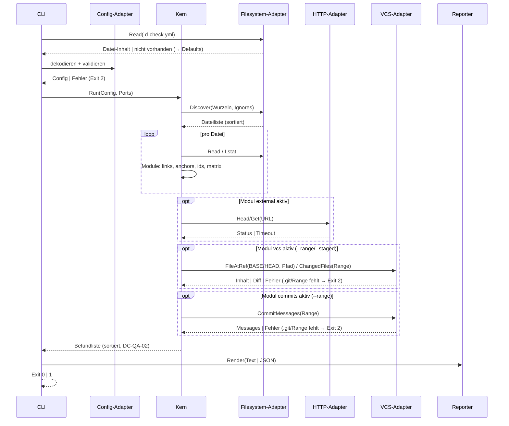

# Architektur — d-check

**Status:** Aktiv. **Letzte Änderung:** 2026-06-29.

**Hard Rule:** Diese Datei ist **sprach- und meilensteinfrei**: Sie
benennt Schichten und Rollen, keine Technologie, und enthält keine
Wellen, Slices, Commit-Hashes oder Closure-Daten (`AGENTS.md` §3.4).
Die zeitliche Schicht lebt in `docs/plan/planning/`.

**Bezug:** [`lastenheft.md`](lastenheft.md) und
[`spezifikation.md`](spezifikation.md) — bei Konflikt gewinnen diese.
Der hexagonale Schnitt („Hexagon light") ist per ADR entschieden; die
Begründung und die sprachkonkrete Übersetzung (Modul-Pfade,
Import-Regeln) leben dort, und die ADRs deklarieren ihre Schärfung
dieser Datei aufwärts (`Schärft:`-Feld). Spec-Straten verweisen nicht
abwärts auf ADRs oder Planning-Artefakte.

---

## 1. Komponenten-Übersicht

Das CLI ist der **einzige driving Adapter** (kein Server-Modus). Die
Regelmodule (`links`, `anchors`, `ids`, `matrix`, `external`) sind
Strategien im Kern hinter einem gemeinsamen Interface
([`DC-FA-CLI-002`](lastenheft.md#dc-fa-cli-002--regelmodul-auswahl));
neue Module sind Kern-Erweiterungen, keine Architekturänderungen. Der Kern
ist intern in drei Pakete mit einbahniger Importrichtung geschnitten —
`model` (Daten) ← `rules` (Prüf-Engine: Module + Orchestrierung) ← `app`
(Modi `--doctor`/`--repair`/`--suggest-config`).

## 2. Schichten und Constraints

| Schicht / Rolle | Verantwortlichkeit | Darf nutzen | Darf NICHT nutzen |
|---|---|---|---|
| Kern | Markdown-Vorverarbeitung, Link-/Heading-/Kennungs-Extraktion, Slug, Regelmodule, Befund-Modell, deterministische Sortierung, Pfad-/Escape-Regeln; definiert die Ports | reine Standardbibliothek ohne I/O; Port-Interfaces | Dateisystem-, Netzwerk-, Prozess-APIs; Adapter; YAML-Bibliothek |
| Filesystem-Adapter | Datei-Discovery, Lesen, Symlink-Erkennung (Lstat) | Kern-Ports; Dateisystem-API | andere Adapter; Netzwerk |
| HTTP-Adapter | HEAD/GET-Erreichbarkeit, Timeout, Redirect-Limit | Kern-Ports; HTTP-Client | andere Adapter; Dateisystem |
| VCS-/git-Adapter | Lesen der git-Historie aus `.git`: Datei-Inhalt an einem Commit-Ref, geänderte Pfade einer Commit-Range, Commit-Messages einer Range; **rein lesend**, ohne externes git-Binary, ohne Netz (opt-in Module `vcs`, `commits`) | Kern-Ports; git-Objekt-Bibliothek; read-only `.git` | andere Adapter; Netzwerk; Schreiben ins Repository |
| Config-Adapter | `.d-check.yml` strikt dekodieren, zweistufig validieren — den Datei-Inhalt beschafft das CLI über den Filesystem-Adapter, der die einzige Dateisystem-Tür bleibt | Kern-Typen; YAML-Bibliothek | andere Adapter; Dateisystem; Netzwerk |
| Reporter-Adapter | Text-/JSON-Rendering auf stdout/stderr | Kern-Typen; Serialisierung | andere Adapter; Netzwerk; Dateizugriffe jenseits stdout/stderr |
| CLI | Argument-Parsing, Composition Root, Exit-Code | alles oben | — |

Diese Tabelle ist die rollenbasierte Quelle der
`arch-check`-Fitness-Function; ihre sprachkonkrete Übersetzung
(Modul-Pfade, Import-Regeln) trägt die zugehörige ADR und deklariert
sie aufwärts. Eine Lockerung ist eine neue ADR (`AGENTS.md` §3.6).

## 3. Externe Abhängigkeiten

| System | Rolle | Substituierbarkeit |
|---|---|---|
| YAML-Bibliothek | Decoding im Config-Adapter | hoch — vollständig im Adapter gekapselt |
| HTTP-Client der Standardbibliothek | Erreichbarkeits-Checks im HTTP-Adapter | hoch — hinter dem HTTP-Port |
| git-Objekt-Bibliothek (rein in der Implementierungssprache, **kein** externes git-Binary) | Lesen von `.git` im VCS-Adapter (opt-in Module `vcs`, `commits`) | mittel — hinter dem VCS-Port; read-only, netzlos |
| Minimal-Runtime ohne Shell/Paketmanager | Auslieferung | mittel — CA-Bundle-/Non-root-Annahmen |

## 4. Sequenz-Diagramme

### Use-Case: [`DC-FA-CLI-001`](lastenheft.md#dc-fa-cli-001--aufruf-und-scan-wurzel) — Prüflauf

## 5. Fehlermodelle und Resilienz

| Fehlerquelle | Behandelnde Schicht | Wirkung |
|---|---|---|
| ungültige CLI-Nutzung | CLI | stderr, Exit 2 |
| ungültige `.d-check.yml` (Syntax/Semantik) | Config-Adapter | stderr mit Zeilenangabe, Exit 2, keine Prüfung |
| Scan-Wurzel/Datei nicht lesbar | Filesystem-Adapter → CLI | stderr, Exit 2 (kein Teilergebnis als Erfolg) |
| Regelverletzung in Doku | Kern (Regelmodule) | Befund, Exit 1 |
| HTTP-Fehler/Timeout (`external`) | HTTP-Adapter → Kern | Befund, kein Abbruch |
| `.git` fehlt/unlesbar, Range unauflösbar oder Message-Datei unlesbar (`vcs`, `commits`) | VCS-Adapter → CLI | stderr, Exit 2 (fail-closed; eine fehlende git-Eingabe ist kein stilles Grün) |

Der Kern wirft keine I/O-Fehler selbst — sie erreichen ihn als
Port-Ergebnisse; das geprüfte Repository wird nie beschrieben
([`DC-QA-03`](lastenheft.md#dc-qa-03--seiteneffektfreiheit-und-netzwerk-sparsamkeit)).
